# 从贝叶斯视角理解 AI

## 引言: 大模型写的作业会雷同吗?

你有没有想过这样一个问题: *当你和室友一起把某门水课的大作业题目复制到大模型中时, 他会不会每次都产生完全一模一样的答案* ? 如果不会, 为什么呢? 

答案当然是不会。下面我将从概率论和贝叶斯视角出发，逐步解释为什么大模型不会生成完全相同的答案，以及为什么这种随机性实际上是一种优势。

## 条件概率与贝叶斯思想

### 贝叶斯公式

首先让我们回顾概率论中的贝叶斯公式:

$$P(A|B) = \frac{P(B|A) \cdot P(A)}{P(B)}$$

这个公式看似简单，却蕴含了贝叶斯学派的整个世界观。它不仅是一个计算条件概率的工具，更是一种思考和推理的方式。

### 先验与后验

贝叶斯学派认为: **概率不是客观频率，而是对不确定性的量化表达；学习是一个不断用新证据更新信念的过程**。简言之，世界上没有绝对确定的事物，我们通过持续观察获取新证据，不断更新对世界的认知。

从贝叶斯公式的角度理解，若将 $A$ 视为假设，$B$ 视为观测到的证据，则:

- $P(A)$ 是**先验概率** (Prior)：在观测到证据 $B$ 之前，我们对假设 $A$ 成立概率的初始估计
- $P(A|B)$ 是**后验概率** (Posterior)：在观测到证据 $B$ 之后，我们对假设 $A$ 成立概率的更新估计
- $P(B|A)$ 是**似然** (Likelihood)：假设 $A$ 成立的条件下，观测到证据 $B$ 的概率
- $P(B)$ 是**边缘概率** (Marginal Probability)：观测到证据 $B$ 的总体概率

用更直观的表达式:

$$P(\text{假设}|\text{证据}) = \frac{P(\text{证据}|\text{假设}) \times P(\text{假设})}{P(\text{证据})}$$

即: **后验 = 似然 × 先验 ÷ 证据概率**

### 频率学派 vs. 贝叶斯学派

贝叶斯学派与频率学派在概率解释和统计推断方面存在根本差异:

| 频率学派              | 贝叶斯学派                    |
| ----------------- | ------------------------ |
| 概率表示事件的长期频率       | 概率表示信念的主观程度              |
| 参数是固定但未知的常数       | 参数是具有概率分布的随机变量           |
| 依赖 $p$ 值和置信区间     | 使用后验分布和可信区间              |
| 不使用先验信息           | 明确纳入先验信息                 |
| 主要方法：最大似然估计 (MLE) | 主要方法：最大后验估计 (MAP)、完全后验分布 |

## 判别式模型

以图像分类为例，模型预测过程涉及三个主体：模型参数 $\theta$、输入数据 $\mathbf{x}$（及其真实标签 $y$）和预测结果 $\hat{y}$。从概率角度看，预测过程就是**在给定输入 $\mathbf{x}$ 的条件下，找出使条件概率 $P(y|\mathbf{x},\theta)$ 最大的类别 $\hat{y}$**:

$$\hat{y} = \arg\max_y P(y|\mathbf{x},\theta)$$

关键问题是：如何确定最优的模型参数 $\theta$？这就涉及到不同的参数估计方法。

### 最大似然估计 (MLE)

频率学派采用最大似然估计，寻找能最大化观测数据概率的参数 (换句话说: 最能解释数据集的参数):

$$\theta_{\text{MLE}} = \arg\max_\theta P(D|\theta)$$

其中 $D = \{(\mathbf{x}_i, y_i)\}_{i=1}^n$ 是训练数据集。假设数据独立同分布 (i.i.d.)，似然函数可表示为:

$$P(D|\theta) = \prod_{i=1}^n P(y_i|\mathbf{x}_i,\theta)$$

为便于计算，通常取对数转换乘积为求和:

$$\log P(D|\theta) = \sum_{i=1}^n \log P(y_i|\mathbf{x}_i,\theta)$$

这正是我们熟悉的交叉熵损失函数的负值。

### 最大后验估计 (MAP)

贝叶斯学派则考虑参数 $\theta$ 的先验分布，采用最大后验估计:

$$\theta_{\text{MAP}} = \arg\max_\theta P(\theta|D) = \arg\max_\theta \frac{P(D|\theta)P(\theta)}{P(D)}$$

由于 $P(D)$ 对参数优化而言是常数，简化为:

$$\theta_{\text{MAP}} = \arg\max_\theta P(D|\theta)P(\theta)$$

取对数后:

$$\theta_{\text{MAP}} = \arg\max_\theta \left[ \log P(D|\theta) + \log P(\theta) \right]$$

可以看出，MAP 比 MLE 多了先验项 $\log P(\theta)$，这实际上起到了正则化作用。例如，当先验为高斯分布 $P(\theta) \sim \mathcal{N}(0, \sigma^2)$ 时，$\log P(\theta)$ 对应于 $L_2$ 正则化；当先验为拉普拉斯分布时，对应于 $L_1$ 正则化。

### 完全贝叶斯推断

更进一步，完全贝叶斯推断不仅寻找单一最优参数点，而是**考虑所有可能参数及其概率分布**:

$$P(y|\mathbf{x}, D) = \int P(y|\mathbf{x}, \theta) P(\theta|D) d\theta$$

这个积分通常难以解析计算，需要借助变分推断 (Variational Inference) 或马尔可夫链蒙特卡洛 (MCMC) 等近似方法。完全贝叶斯推断的优势在于能够量化预测的不确定性，而不仅仅给出点估计。

## 生成式模型

我们使用的大模型和上文的判别式模型有一个本质区别就是: **判别式模型给定输入 x 的情况下, 输出的 lable 是确定的**, 但是大模型每次生成文本都有不同之处, 这是因为实际上每次大模型生成的是下一个词语的概率分布, 然后按照某种方式在其中采样, 我们把这种模型叫做**生成式模型**

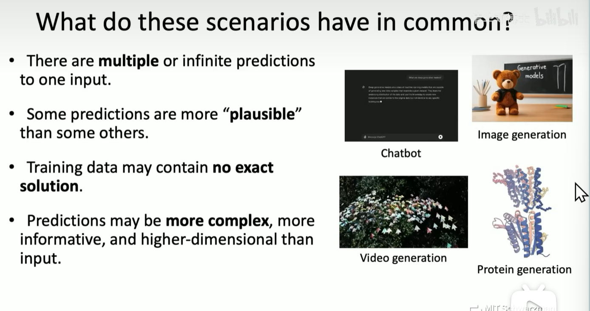

生成式模型特点
- 一个输入多个输出：同一个输入可能对应多种合理的输出结果
- 训练数据中没有确切的解：不像分类任务有唯一正确答案
- 难以预测：输出空间通常非常大且复杂

生成式模型的核心目标是学习数据的分布，而不仅仅是将输入映射到特定输出。这使得它们能够生成新的、多样化的、符合真实数据分布的样本。

### 判别式 vs 生成式

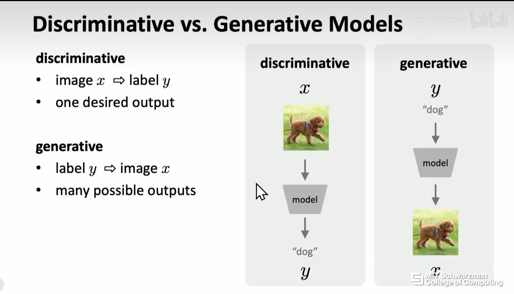

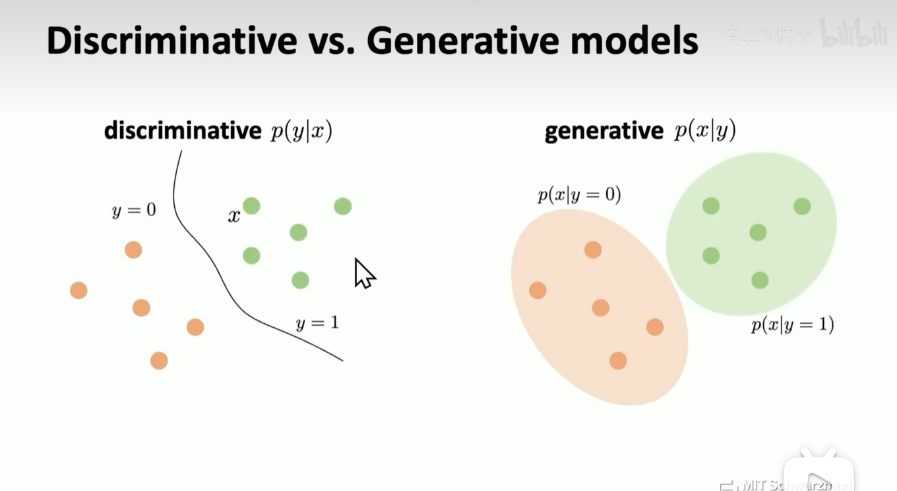
- 判别式模型: $P(y|x)$ - 给定输入 x，预测标签 y 的概率
  - 例如：分类器、回归模型
  - 关注决策边界，区分不同类别
  - 通常计算效率更高，需要的数据更少
  
- 生成式模型: $P(x|y)$ 或 $P(x,y)$ 或 $P(x)$, 给定输入标签 y，生成一个最可能符合现实中数据分布的 x
  - 学习数据本身的联合分布
  - 能够生成新样本
  - 通常需要更多参数和训练数据
  - 提供更丰富的信息（联合概率分布）

### 概率建模

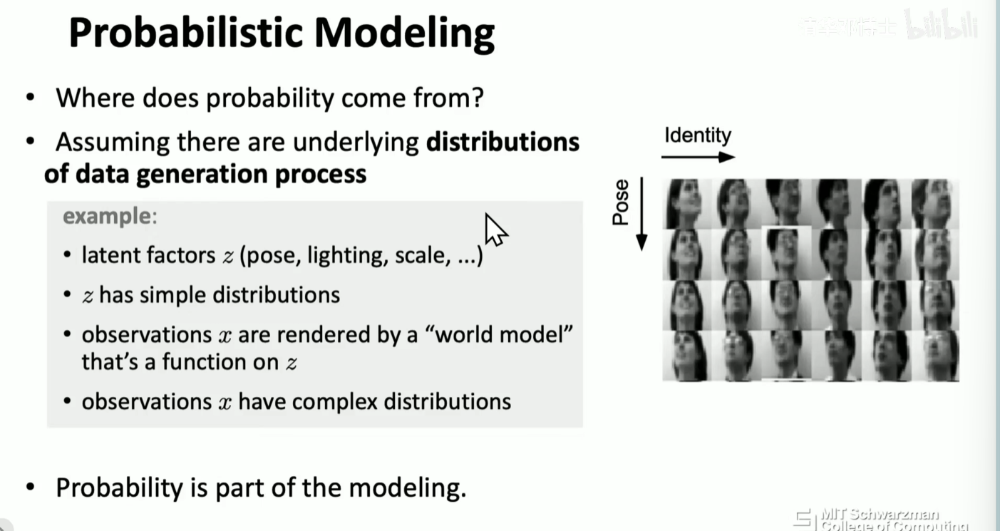

- **潜在因子（Latent Factors）**：用 z 表示隐藏变量，如物体的姿势（pose）、光照（lighting）、尺度（scale）等。这些因子本身服从简单分布。
  - 潜在空间通常是低维的，具有良好的结构
  - 潜在变量捕获了数据生成过程中的关键因素

- **观察值生成**：观察数据 x（如图像）由 "世界模型" 渲染生成，而世界模型是关于 z 的函数。最终，观察值 x 会呈现复杂分布。
  - 世界模型可以看作是从简单分布到复杂分布的变换
  - 深度神经网络可以作为这种变换的强大近似器

- 我们通过深度学习对整个数据的分布进行建模, 使得可以采样出符合真实世界的数据 z, 而这个过程的关键就是概率

**数学表示**：

**生成模型的核心思想是通过联合分布 P (x, z) 来求解数据的边缘分布 P (x)**

- 联合分布：$P(x,z) = P(x|z)P(z)$
- 边缘分布：$P(x) = \int P(x|z)P(z)dz$
- 后验分布：$P(z|x) = \frac{P(x|z)P(z)}{P(x)}$

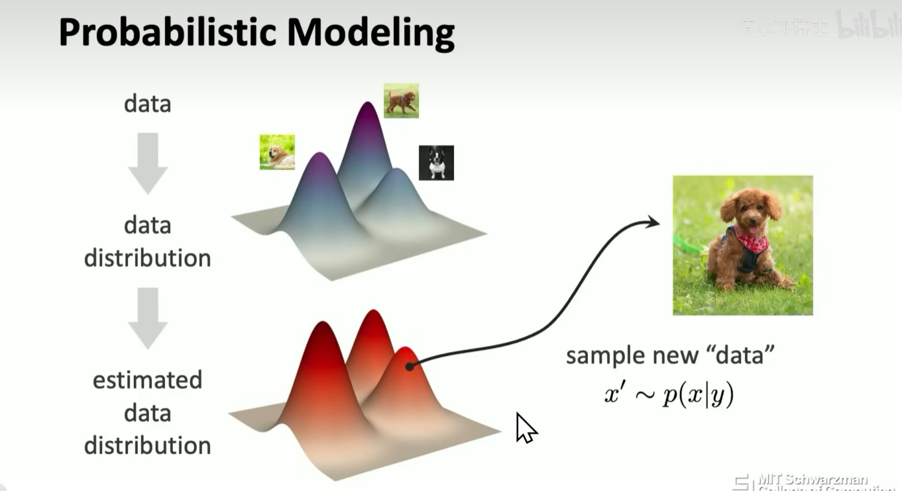

对估计的概率分布和数据的分布进行对比, 作为损失函数。常用的度量方式包括：
- KL 散度：$D_{KL}(P_{data}||P_{model})$
- 最大似然估计：最大化 $\log P_{model}(x)$
- Wasserstein 距离：用于 WGAN 等模型

## Deep Generative Models

### 表征学习

深度学习的核心任务之一是表征学习, 即在原始数据中自动提取对任务有用的特征（即“表示”），而无需人工设计特征。

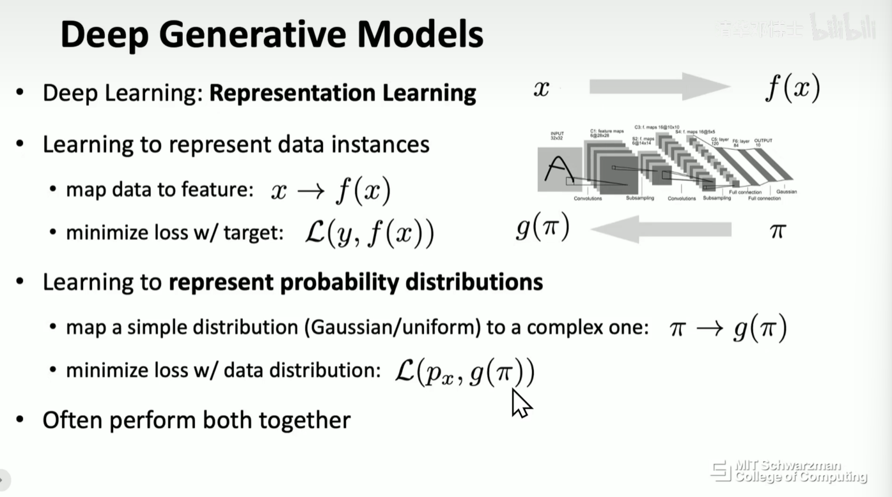

为什么深度学习有用? 因为它的**分层结构**可以自动学习数据的**层次化表示**：
- 低层特征：边缘、纹理、简单形状
- 中层特征：部件、组合结构
- 高层特征：语义概念、抽象表示

这种表示学习能力使深度学习模型能够捕获数据中的复杂模式。

### 建模概率分布

既然深度学习可以通过表征学习去学习数据的信息, 那么他当然也可以学习数据的分布, 一种直观的的方式是, 我们通过模型的学习把简单分布建模为复杂分布

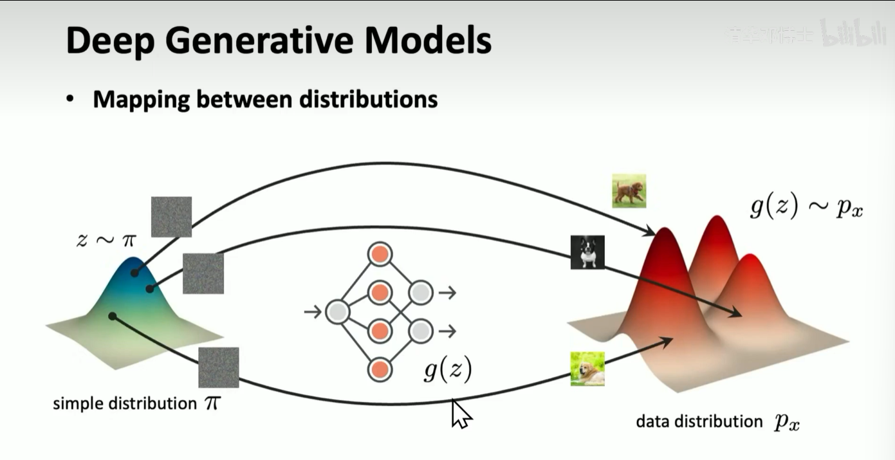

- 使用神经网络参数化概率分布
- 将简单的先验分布（如高斯分布）转换为复杂的数据分布
- 学习数据的隐含结构和生成过程

POV:
- 生成模型会将一些深度神经网络作为构建模块。
- 就像深度神经网络会将某些 "层" 作为构建模块一样。
- 生成模型是更高层级的抽象。

### 使用方法

生成式模型的核心是学习从条件信息 y 到目标数据 x 的映射过程：$P(x|y)$

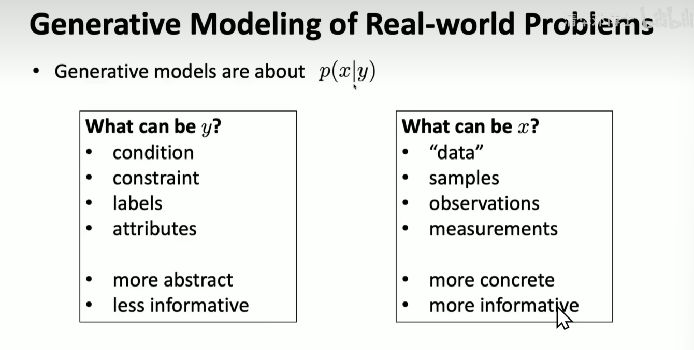

条件信息 y 在实际应用中可以是多种形式：
- **文本描述**：如"一只橙色的猫坐在窗台上"（文生图）
- **类别标签**：如数字"7"（条件图像生成）
- **属性向量**：如年龄、性别、表情等（人脸生成）
- **部分数据**：如图像的一部分（图像补全）
- **其他模态数据**：如音频、视频片段（跨模态生成）

本质上，y 是对生成空间的约束，它提供了低熵、高抽象的信息，而模型则负责将这些约束转化为高熵、高细节的具体数据 x。这种从抽象到具体的映射过程，使生成式模型能够在保持一致性的同时产生多样化的输出。

深度生成模型的主要应用场景：
1. **数据生成**：创建新的、逼真的样本
2. **数据增强**：为监督学习任务生成额外训练数据
3. **异常检测**：识别不符合学习分布的样本
4. **缺失数据填补**：根据部分观察推断完整数据
5. **压缩表示**：学习数据的紧凑编码

## 主要生成模型类型

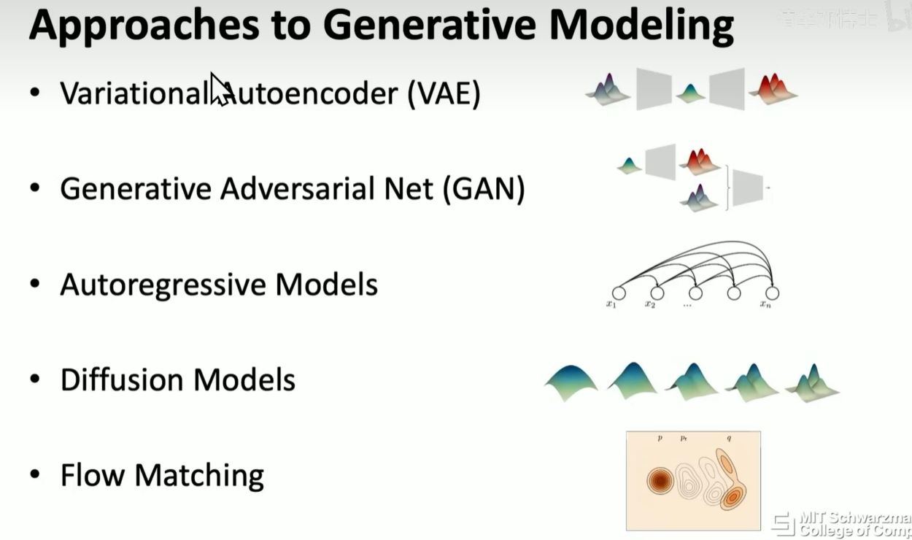

### 自回归模型 (Autoregressive Models)

自回归模型将联合分布分解为条件概率的乘积：
$P(x) = \prod_{i=1}^{n} P(x_i|x_{<i})$

特点：
- 显式密度模型，可以直接计算似然
- 生成过程是顺序的，每次生成一个元素
- 代表模型：PixelRNN, PixelCNN, WaveNet, 语言模型
- 最近特别强大的 GPT4o 就使用了自回归模型而非 diffusion model 来生成图像, 效果极其恐怖

### 变分自编码器 (VAE)

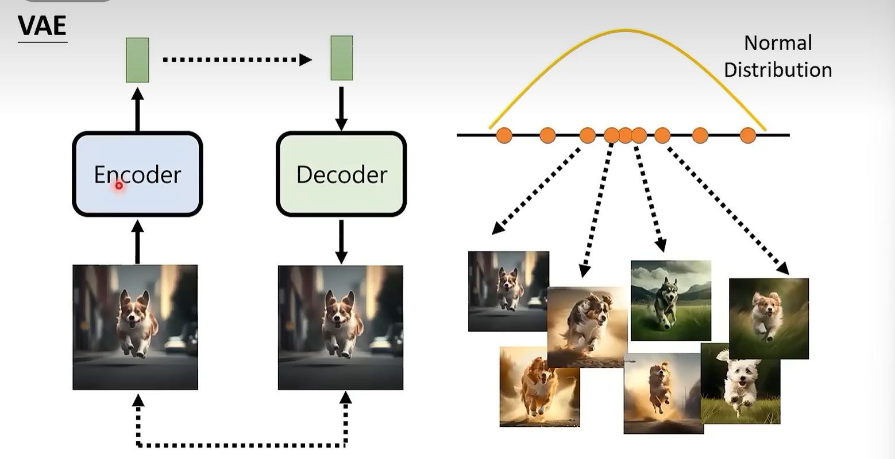

VAE 通过变分推断学习潜在变量模型, 直接对一个图片建立一个概率分布：
- 编码器网络：$q_\phi(z|x)$ 近似后验分布
- 解码器网络：$p_\theta(x|z)$ 从潜在变量重建数据
- 目标函数：ELBO (Evidence Lower BOund)
  $$\mathcal{L}(\theta,\phi;x) = \mathbb{E}_{q_\phi(z|x)}[\log p_\theta(x|z)] - D_{KL}(q_\phi(z|x)||p(z))$$

特点：
- 学习有意义的潜在空间
- 生成质量通常不如 GAN
- 训练稳定，避免模式崩溃
- 后续成为了 stable diffusion 的一个模块

### 生成对抗网络 (GAN)

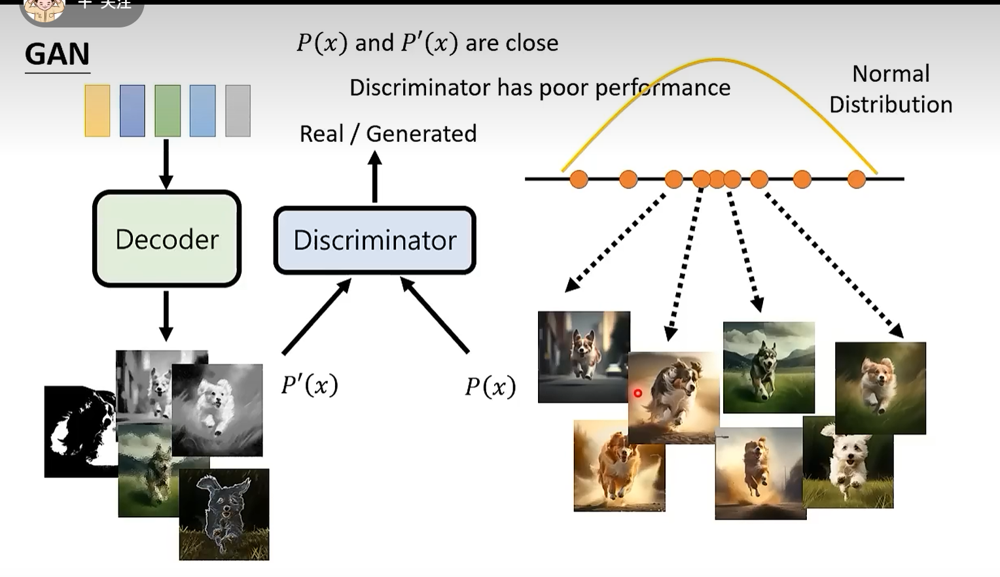

GAN 通过博弈论框架学习生成模型：
- 生成器 G：创建看起来真实的样本
- 判别器 D：区分真实样本和生成样本
- 目标函数：

$$\min_G \max_D V(D,G) = \mathbb{E}_{x\sim p_{data}}[\log D(x)] + \mathbb{E}_{z\sim p_z}[\log(1-D(G(z)))]$$

特点：
- 生成质量极高
- 训练不稳定，容易模式崩溃
- 难以评估模型质量
- 变种众多：DCGAN, WGAN, StyleGAN 等

效果图:

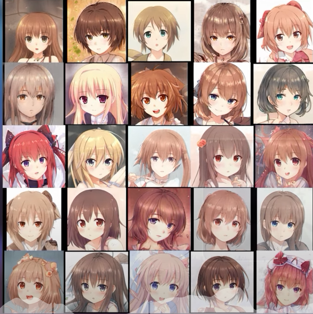 image 20250330101500. Png

### 扩散模型 (Diffusion Models)

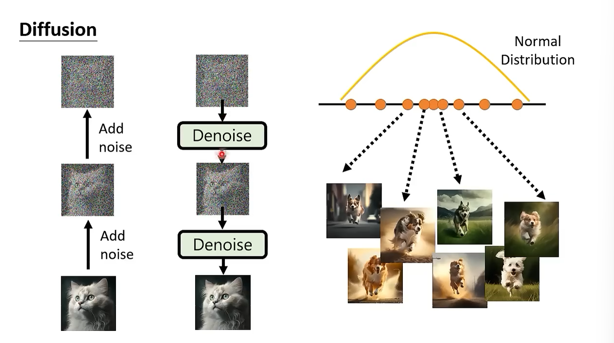

扩散模型通过逐步去噪学习生成过程：
- 前向过程：逐步向数据添加噪声
- 反向过程：学习去噪，恢复原始数据
- 目标函数：预测添加的噪声

特点：
- 生成质量超越 GAN
- 训练稳定
- 推理速度较慢
- 代表模型：DDPM, DALL-E 2, Stable Diffusion

## 总结

本文通过贝叶斯视角揭示了现代AI的核心本质：

1. **贝叶斯思想的革命性影响**：贝叶斯学派将概率从客观频率重新定义为不确定性的度量，这一转变是现代AI能够处理复杂、不确定世界的理论基础。

2. **判别式到生成式的范式转变**：
   - 判别式模型（$P(y|x)$）只关注输入到输出的映射，本质上是确定性的
   - 生成式模型（$P(x,y)$或$P(x)$）学习数据本身的分布，能够产生多样化输出
   - 这一转变解释了为什么大模型能够对同一问题给出不同但合理的回答

3. **潜变量与概率分布变换**：
   - 引入潜变量$z$是现代生成模型的关键突破
   - 通过将复杂分布表示为简单分布的变换，AI获得了"创造性"
   - 深度神经网络作为这种变换的强大近似器，使复杂分布的建模成为可能

4. **采样机制的重要性**：
   - 大模型不是简单地记忆和重复，而是从学习到的概率分布中采样
   - 这种机制使AI能够生成新颖且多样的内容，而非固定输出

这种基于概率的视角不仅统一了从VAE到GAN再到扩散模型和自回归模型的技术路线，也为我们理解AI的能力边界提供了理论框架。正是贝叶斯思想的引入，使AI从简单的模式匹配工具进化为能够处理不确定性、具有创造性的智能系统。

回到开篇的问题：大模型写的作业不会雷同，正是它们不是确定性地输出"最优解"，而是从学习到的概率分布中进行采样，这种基于概率的生成机制是现代AI最本质的特征。