## 操作系统基础

### 什么是操作系统

- 操作系统（Operating System，简称 OS）是管理计算机硬件与软件资源的程序，是计算机的管理员
- 操作系统**本质上是一个运行在计算机上的软件程序** ，主要用于管理计算机硬件和软件资源
- 操作系统存在屏蔽了硬件层的复杂性。 *没有什么问题是加一个中间层无法解决的*, os 就是硬件和应用程序的中间层
- 操作系统的 **内核(Kernel)** 是操作系统的核心部分，它负责系统的**内存管理，硬件设备的管理，文件系统的管理以及应用程序的管理**。内核是连接应用程序和硬件的桥梁，决定着系统的性能和稳定性。

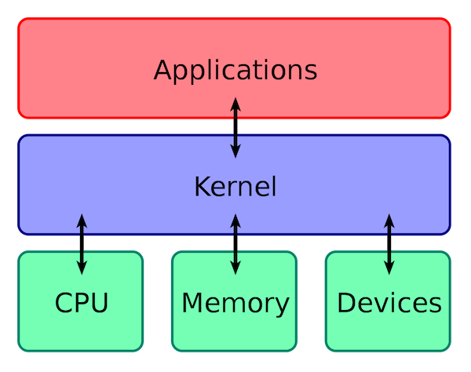

### 操作系统有哪些功能

从资源管理的角度来看，操作系统有 6 大功能：

1. **进程和线程的管理**：进程的创建、撤销、阻塞、唤醒，进程间的通信等。
2. **存储管理**：内存的分配和管理、外存（磁盘等）的分配和管理等。
3. **文件管理**：文件的读、写、创建及删除等。
4. **设备管理**：完成设备（输入输出设备和外部存储设备等）的请求或释放，以及设备启动等功能。
5. **网络管理**：操作系统负责管理计算机网络的使用
6. **安全管理**：用户的身份认证、访问控制、文件加密等，以防止非法用户对系统资源的访问和操作。

### 用户态和内核态

> 什么是用户态和内核态

根据进程对资源的访问权限，我们可以把进程在系统上的运行分为两个级别：

- **用户态(User Mode)** : 用户态运行的进程可以直接读取用户程序的数据，拥有较低的权限。当应用程序需要执行某些需要**特殊权限**的操作，例如读写磁盘、网络通信等，就需要向操作系统发起系统调用请求，进入内核态。
- **内核态(Kernel Mode)**：内核态运行的进程几乎可以访问计算机的任何资源包括系统的内存空间、设备、驱动程序等，不受限制，拥有非常高的权限。当操作系统接收到进程的系统调用请求时，就会从用户态切换到内核态，执行相应的系统调用，并将结果返回给进程，最后再从内核态切换回用户态。

> 为什么要用用户态和内核态? 只有内核态不行吗

- 在 **CPU 的所有指令**中，有一些指令是比较**危险**的比如内存分配、设置时钟、IO 处理等，叫做特权指令. 我们不希望每个用户都可以执行这些指令

> PS: syscall 不是函数, 而是汇编意义上的指令

- 如果计算机系统中只有一个内核态，那么所有程序或进程都必须共享系统资源，例如内存、CPU、硬盘等，这将导致系统资源的竞争和冲突，从而影响系统性能和效率。并且，这样也会让系统的安全性降低，毕竟所有程序或进程都具有相同的特权级别和访问权限。

> **用户态和内核态如何切换**


用户态切换到内核态的 3 种方式：

1. **系统调用（Trap）**：用户态进程 **主动** 要求切换到内核态的一种方式，主要是为了使用内核态才能做的事情比如读取磁盘资源。
2. **中断（Interrupt）**：来自外部的打断, 比如时间片轮转的计时器, 或者 dma 在处理完成文件传输后会给 cpu 一个中断
3. **异常（Exception）**：**来自程序内部的事先不可知的异常**，这时会触发由当前运行进程切换到处理此异常的内核相关程序中，也就转到了内核态，比如缺页异常。

### 系统调用

> 什么是系统调用?

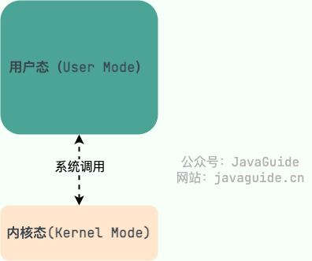

当用户态的程序想要执行 os 提供的功能时, 就需要通过 `trap` 执行系统调用

也就是说在我们运行的用户程序中，凡是与**系统态级别的资源有关的操作**（如文件管理、进程控制、内存管理等)，都必须通过系统调用方式向操作系统提出服务请求，并由操作系统代为完成。

> 系统调用的过程了解吗

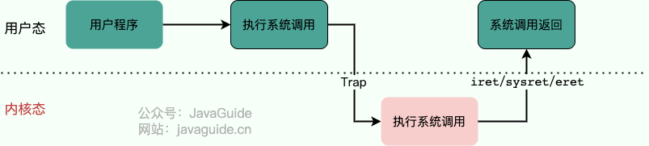

系统调用的过程可以简单分为以下几个步骤：

1. 用户态的程序执行到**特权指令**比如 `open`, `write`, `malloc` 之类的，用户态程序权限不足，因此会中断执行，也就是 **Trap**
2. 发生中断后，当前 CPU 执行的程序会中断，进入内核态, 跳转到中断处理程序(handler)。内核程序开始执行，也就是开始处理系统调用。
3. 内核处理完成后，主动触发 Trap，这样会再次发生中断，切换回用户态工作。

## 进程和线程

### 概念

> 什么是进程和线程

- **进程（Process）** 是指计**算机中正在运行的一个程序实例**。举例：你打开的微信就是一个进程。
- **线程（Thread）** 也被称为轻量级进程，更加轻量。多个线程可以在同一个进程中同时执行，并且共享进程的资源. 
- **线程是程序执行的最小单元**

> 进程与线程的区别

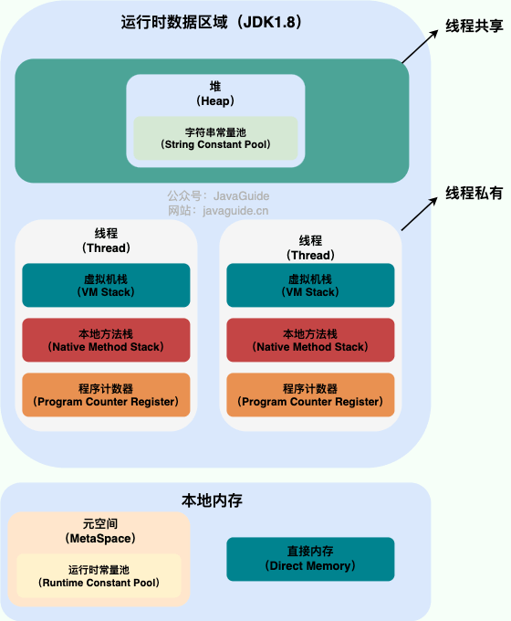

从上图可以看出：一个进程中可以有多个线程，多个线程共享进程的**堆**和**方法区 (JDK1.8 之后的元空间)** 资源，但是每个线程有自己的**程序计数器**、**虚拟机栈** 和 **本地方法栈**。

- 线程是进程划分成的更小的运行单位,一个进程在其执行的过程中可以产生多个线程。
- 进程是 os 提供的隔离和保护的最小单元, 线程是程序执行的最小单元, 是一个个指令流
- 线程执行开销小，但不利于资源的管理和保护；而进程正相反。

> 有了进程为什么还需要线程

- 进程切换是一个开销很大的操作，线程切换的成本较低。
- 线程更轻量，一个进程可以创建多个线程。
- 多个线程可以并发处理不同的任务，更有效地利用了多处理器和多核计算机。而单线程的进程只能在一个时间干一件事，如果在执行过程中遇到阻塞问题比如 IO 阻塞就会挂起直到结果返回。
- 同一进程内的线程**共享内存和文件**，因此它们之间相互通信无须调用内核。

> 为什么要用多线程

- **从计算机底层来说：** 线程可以比作是轻量级的进程，是程序执行的最小单位,线程间的切换和调度的成本远远小于进程。另外，多核 CPU 时代意味着多个线程可以同时运行，这**减少了线程上下文切换的开销**。
- 多线程并发编程正是**开发高并发系统的基础**，利用好多线程机制可以大大提高系统整体的并发能力以及性能。
- 减少了单线程程序被阻塞所占用的时间, **提高了 java 进程对系统资源的利用率**
- 当前 cpu 的核心频率由于技术问题难以提升, 所以通过增加 cpu 核心数量来提升性能. 只有多线程才能提高对计算机硬件的利用

> 线程间同步的方式

线程同步是两个或多个共享关键资源的线程的并发执行。应该同步线程以避免关键的资源使用冲突。

- **互斥锁(Mutex)** 
- **读写锁（Read-Write Lock）**
- **信号量(Semaphore)** 
- **屏障（Barrier）** 
- **事件(Event)**

> PCB 是什么? 包含哪些信息

**PCB（Process Control Block）** 即进程控制块，是操作系统中用来管理和跟踪进程的数据结构，每个进程都对应着一个独立的 PCB。你可以将 PCB 视为进程的大脑。

当操作系统创建一个新进程时，会为该进程分配一个唯一的 PID，并且为该进程创建一个对应的进程控制块。当进程执行时，PCB 中的信息会不断变化，操作系统会根据这些信息来管理和调度进程。

PCB 主要包含下面几部分的内容：

- 进程的**描述信息**，包括进程的名称、标识符等等；
- 进程的**调度信息**，包括进程阻塞原因、进程状态（就绪、运行、阻塞等）、进程优先级（标识进程的重要程度）等等；
- 进程对**资源的需求情况**，包括 CPU 时间、内存空间、I/O 设备等等。
- 进程**打开的文件信息**，包括文件描述符、文件类型、打开模式等等。
- **处理机的状态信息**（由处理机的各种寄存器中的内容组成的），包括通用寄存器、指令计数器、程序状态字 PSW、用户栈指针

### 进程调度

> 进程有哪几种状态

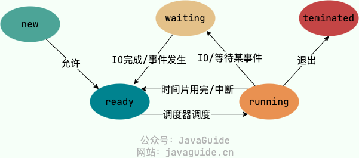

我们一般把进程大致分为 5 种状态，这一点和线程很像！

- **创建状态(new)**：进程正在被创建，尚未到就绪状态。
- **就绪状态(ready)**：进程已处于准备运行状态，即进程获得了除了处理器之外的一切所需资源，一旦得到处理器资源(处理器分配的时间片)即可运行。
- **运行状态(running)**：进程正在处理器上运行
- **阻塞状态(waiting)**：又称为等待状态，进程正在等待某一事件而暂停运行
- **结束状态(terminated)**：进程正在从系统中消失。可能是进程正常结束或其他原因中断退出运行。

> 进程间的通信方式有哪些?

- **管道/匿名管道(Pipes)** ：用于具有亲缘关系的父子进程间或者兄弟进程之间的通信。
- **有名管道(Named Pipes)** : 匿名管道由于没有名字，只能用于亲缘关系的进程间通信。为了克服这个缺点，提出了有名管道。有名管道严格遵循 **先进先出(First In First Out)** 。有名管道以磁盘文件的方式存在，可以实现本机任意两个进程通信。
- **信号(Signal)** ：信号是一种比较复杂的通信方式，用于通知接收进程某个事件已经发生；
- **消息队列(Message Queuing)** ：消息队列是消息的链表,具有特定的格式,存放在内存中并由消息队列标识符标识。管道和消息队列的通信数据都是先进先出的原则。存放于内核中
- **信号量(Semaphores)** ：信号量是一个计数器，用于多进程对共享数据的访问，信号量的意图在于进程间同步。
- **共享内存(Shared memory)** ：使得多个进程可以访问同一块内存空间，不同进程可以及时看到对方进程中对共享内存中数据的更新。这种方式需要依靠某种同步操作，如互斥锁和信号量等。可以说这是**最有用的进程间通信方式**。
- **套接字(Sockets)** : 此方法主要用于在客户端和服务器之间通过网络进行通信。

> 进程的调度算法有哪些

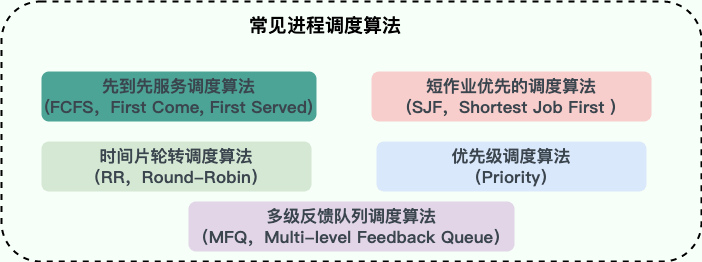

这是一个很重要的知识点！为了确定首先执行哪个进程以及最后执行哪个进程以实现最大 CPU 利用率，计算机科学家已经定义了一些算法，它们是：

- **先到先服务调度算法(FCFS，First Come, First Served)** : 从就绪队列中选择一个最先进入该队列的进程为之分配资源，使它立即执行并一直执行到完成或发生某事件而被阻塞放弃占用 CPU 时再重新调度。
- **短作业优先的调度算法(SJF，Shortest Job First)** : 从就绪队列中选出一个估计运行时间最短的进程为之分配资源，使它立即执行并一直执行到完成或发生某事件而被阻塞放弃占用 CPU 时再重新调度
- **时间片轮转调度算法（RR，Round-Robin）** : 时间片轮转调度是一种最古老，最简单，最公平且使用最广的算法。每个进程被分配一个时间段，称作它的时间片，即该进程允许运行的时间。
- **多级反馈队列调度算法（MFQ，Multi-level Feedback Queue）**：多级反馈队列调度算法既能使高优先级的作业得到响应又能使短作业（进程）迅速完成，因而它是目前**被公认的一种较好的进程调度算法**，UNIX 操作系统采取的便是这种调度算法。
- **优先级调度算法（Priority）**：为每个流程分配优先级，首先执行具有最高优先级的进程，依此类推。具有相同优先级的进程以 FCFS 方式执行。可以根据内存要求，时间要求或任何其他资源要求来确定优先级。

> 什么是僵尸进程和孤儿进程

在 Unix/Linux 系统中，子进程通常是通过 fork()系统调用创建的，该调用会创建一个新的进程，该进程是原有进程的一个副本。子进程和父进程的运行是相互独立的，它们各自拥有自己的 PCB，即使父进程结束了，子进程仍然可以继续运行。

当一个进程调用 exit()系统调用结束自己的生命时，内核会释放该进程的所有资源，包括打开的文件、占用的内存等，但是该进程对应的 PCB 依然存在于系统中。这些信息只有在父进程调用 wait()或 waitpid()系统调用时才会被释放，以便让父进程得到子进程的状态信息。


- **僵尸进程**：子进程已经终止，但是其父进程仍在运行，且父进程没有调用 wait()或 waitpid()等系统调用来获取子进程的状态信息，释放子进程占用的资源，导致子进程的 PCB 依然存在于系统中，但无法被进一步使用。这种情况下，子进程被称为“僵尸进程”。避免僵尸进程的产生，父进程需要及时调用 wait()或 waitpid()系统调用来回收子进程。
- **孤儿进程**：一个进程的父进程已经终止或者不存在，但是该进程仍在运行。这种情况下，该进程就是孤儿进程。孤儿进程通常是由于父进程意外终止或未及时调用 wait()或 waitpid()等系统调用来回收子进程导致的。为了避免孤儿进程占用系统资源，操作系统会将孤儿进程的父进程设置为 init 进程（进程号为 1），由 init 进程来回收孤儿进程的资源。

> 如何查看僵尸进程

`top` 命令

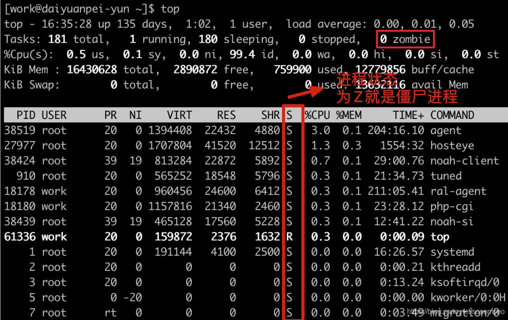

### 死锁

> 什么是死锁

死锁（Deadlock）描述的是这样一种情况：多个进程/线程同时被阻塞，它们中的一个或者全部都在等待某个资源被释放。由于进程/线程被无限期地阻塞，因此程序不可能正常终止。

> 举一个操作系统发生死锁的例子

假设有两个进程 A 和 B，以及两个资源 X 和 Y，它们的分配情况如下：

|进程|占用资源|需求资源|
|---|---|---|
|A|X|Y|
|B|Y|X|

此时，进程 A 占用资源 X 并且请求资源 Y，而进程 B 已经占用了资源 Y 并请求资源 X。两个进程都在等待对方释放资源，无法继续执行，陷入了死锁状态。

> 产生死锁的四个**必要条件**

- **互斥**：资源必须处于非共享模式，即一次只有一个进程可以使用。如果另一进程申请该资源，那么必须等待直到该资源被释放为止。
- **占有并等待**：一个进程至少应该占有一个资源，并等待另一资源，而该资源被其他进程所占有。
- **非抢占**：资源不能被抢占。只能在持有资源的进程完成任务后，该资源才会被释放。
- **循环等待**：有一组等待进程 `{P0, P1,..., Pn}`， `P0` 等待的资源被 `P1` 占有，`P1` 等待的资源被 `P2` 占有，……，`Pn-1` 等待的资源被 `Pn` 占有，`Pn` 等待的资源被 `P0` 占有。

> 模拟死锁

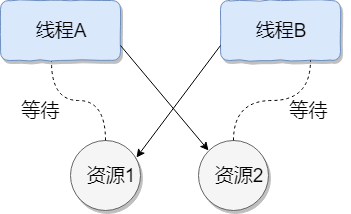

```java
public class DeadLockDemo {
    private static Object resource1 = new Object();//资源 1
    private static Object resource2 = new Object();//资源 2

    public static void main(String[] args) {
        new Thread(() -> {
            synchronized (resource1) {
                System.out.println(Thread.currentThread() + "get resource1");
                try {
                    Thread.sleep(1000);
                } catch (InterruptedException e) {
                    e.printStackTrace();
                }
                System.out.println(Thread.currentThread() + "waiting get resource2");
                synchronized (resource2) {
                    System.out.println(Thread.currentThread() + "get resource2");
                }
            }
        }, "线程 1").start();

        new Thread(() -> {
            synchronized (resource2) {
                System.out.println(Thread.currentThread() + "get resource2");
                try {
                    Thread.sleep(1000);
                } catch (InterruptedException e) {
                    e.printStackTrace();
                }
                System.out.println(Thread.currentThread() + "waiting get resource1");
                synchronized (resource1) {
                    System.out.println(Thread.currentThread() + "get resource1");
                }
            }
        }, "线程 2").start();
    }
}
```

> 死锁的解决方案

思路: **破坏四个必要条件, 一般考虑破坏 2,4, 占有并等待和非抢占**

#### **死锁的预防**

1、静态分配策略

静态分配策略可以破坏死锁产生的**第二个条件**（占有并等待）。所谓静态分配策略，就是指**一个进程必须在执行前就申请到它所需要的全部资源，并且知道它所要的资源都得到满足之后才开始执行**。进程要么占有所有的资源然后开始执行，要么不占有资源，不会出现占有一些资源等待一些资源的情况。

静态分配策略逻辑简单，实现也很容易，但这种策略 **严重地降低了资源利用率**，因为在每个进程所占有的资源中，有些资源是在比较靠后的执行时间里采用的，甚至有些资源是在额外的情况下才使用的，这样就可能造成一个进程占有了一些 **几乎不用的资源而使其他需要该资源的进程产生等待** 的情况。

2、层次分配策略

层次分配策略破坏了产生死锁的第四个条件(循环等待)。在层次分配策略下，所有的资源被分成了多个层次，**一个进程得到某一次的一个资源后，它只能再申请较高一层的资源；当一个进程要释放某层的一个资源时，必须先释放所占用的较高层的资源**，按这种策略，是**不可能出现循环等待链**的，因为那样的话，就出现了已经申请了较高层的资源，反而去申请了较低层的资源，不符合层次分配策略，证明略。

#### **死锁的避免**

上面提到的 **破坏** 死锁产生的四个必要条件之一就可以成功 **预防系统发生死锁** ，但是会导致 **低效的进程运行** 和 **资源使用率** 。而死锁的避免相反，它的角度是允许系统中**同时存在四个必要条件** ，只要掌握并发进程中与每个进程有关的资源动态申请情况，做出 **明智和合理的选择** ，仍然可以避免死锁，因为四大条件仅仅是产生死锁的必要条件。

我们将系统的状态分为 **安全状态** 和 **不安全状态** ，每当在为申请者分配资源前先测试系统状态，若把系统资源分配给申请者会产生死锁，则拒绝分配，否则接受申请，并为它分配资源。比如银行家算法

#### **死锁的解除**

当死锁检测程序检测到存在死锁发生时，应设法让其解除，让系统从死锁状态中恢复过来，常用的解除死锁的方法有以下四种：

1. **立即结束所有进程的执行，重新启动操作系统**：这种方法简单，但以前所在的工作全部作废，损失很大。
2. **撤销涉及死锁的所有进程，解除死锁后继续运行**：这种方法能彻底打破**死锁的循环等待**条件，但将付出很大代价，例如有些进程可能已经计算了很长时间，由于被撤销而使产生的部分结果也被消除了，再重新执行时还要再次进行计算。
3. **逐个撤销涉及死锁的进程，回收其资源直至死锁解除。**
4. **抢占资源**：从涉及死锁的一个或几个进程中抢占资源，把夺得的资源再分配给涉及死锁的进程直至死锁解除。

## 内存管理

### 基本概念

> 内存管理做了什么?

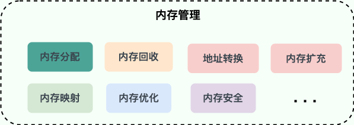

操作系统的内存管理非常重要，主要负责下面这些事情：

- **内存的分配与回收**：对进程所需的内存进行分配和释放，malloc 函数：申请内存，free 函数：释放内存。
- **地址转换**：将程序中的虚拟地址转换成内存中的物理地址。
- **内存扩充**：**让每个程序认为自己拥有无限大的内存**, 必要时对内存空间阔欧容
- **内存映射**：将一个文件直接映射到进程的进程空间中，这样可以通过内存指针用读写内存的办法直接存取文件内容，速度更快。
- **内存优化**：通过调整内存分配策略和回收算法来优化内存使用效率。
- **内存隔离**：**让每个程序认为自己独享整个内存空间**, 保证进程之间使用内存互不干扰，避免一些恶意程序通过修改内存来破坏系统的安全性。

> 什么是内存碎片

内存碎片是由内存的申请和释放产生的，通常分为下面两种：

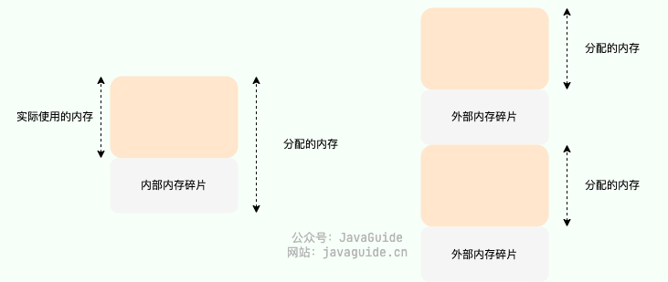

- **内部内存碎片(Internal Memory Fragmentation，简称为内存碎片)**：已经分配给进程使用但未被使用的内存。导致内部内存碎片的主要原因是，**当采用固定比例比如 2 的幂次方进行内存分配时，进程所分配的内存可能会比其实际所需要的大**。举个例子，一个进程只需要 65 字节的内存，但为其分配了 128（2^7） 大小的内存，那 63 字节的内存就成为了内部内存碎片。
- **外部内存碎片(External Memory Fragmentation，简称为外部碎片)**：由于未分配的连续内存区域太小，以至于不能满足任意进程所需要的内存分配请求，这些小片段且不连续的内存空间被称为外部碎片。也就是说，**外部内存碎片指的是那些并未分配给进程但又不能使用的内存**。我们后面介绍的分段机制就会导致外部内存碎片。

> 常见的内存管理方式

内存管理方式可以简单分为下面两种：

- **连续内存管理**：为一个用户程序分配一个连续的内存空间，内存利用率一般不高。
- **非连续内存管理**：允许一个程序使用的内存分布在离散或者说不相邻的内存中，相对更加灵活一些。

连续内存管理:

**块式管理** 是早期计算机操作系统的一种连续内存管理方式，存在严重的内存碎片问题。

在 Linux 系统中，连续内存管理采用了 **伙伴系统（Buddy System）算法** 来实现，基本思想是把内存区域划分为 2 的幂次的 buddy 单元, 然后分配内存时使用二分法, 找到最小的大小合适的单元

但是这个方法无法解决内部碎片问题, Linux 通过 SLAB 解决了内部碎片问题

非连续内存管理:

非连续内存管理存在下面 3 种方式：

- **段式管理**：以段(一段连续的物理内存)的形式管理/分配物理内存。应用程序的虚拟地址空间被分为大小不等的段，段是有实际意义的
- **页式管理**：把物理内存分为连续等长的物理页，应用程序的虚拟地址空间也被划分为连续等长的虚拟页，是现代操作系统广泛使用的一种内存管理方式。
- **段页式管理机制**：结合了段式管理和页式管理的一种内存管理机制，把物理内存**先分成若干段**，每个段又继续分成若干大小相等的页

### 虚拟内存

> 什么是虚拟内存, 有什么用?

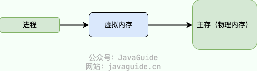

**虚拟内存(Virtual Memory)** 是计算机系统内存管理非常重要的一个技术，本质上来说它只是逻辑存在的，是一个假想出来的内存空间，主要作用是作为进程访问主存（物理内存）的桥梁并简化内存管理。

总的来说, 虚拟内存提供了以下功能

- **隔离进程**：物理内存通过虚拟地址空间访问，虚拟地址空间与进程一一对应。每个进程都认为自己拥有了整个物理内存，进程之间彼此隔离
- **提升物理内存利用率**：有了虚拟地址空间后，操作系统只需要将进程当前正在使用的部分数据或指令加载入物理内存。
- **简化内存管理**：进程都有一个一致且私有的虚拟地址空间，程序员不用和真正的物理内存打交道，而是借助虚拟地址空间访问物理内存，从而简化了内存管理。
- **多个进程共享物理内存**：多程序共享动态链接库
- **提高内存使用安全性**：控制进程对物理内存的访问，隔离不同进程的访问权限，提高系统的安全性。
- **提供更大的可使用内存空间**：可以让程序拥有超过系统物理内存大小的可用内存空间。这是因为当物理内存不够用时，可以利用磁盘充当，将物理内存页（通常大小为 4 KB）保存到磁盘文件（会影响读写速度），数据或代码页会根据需要在物理内存与磁盘之间移动。
