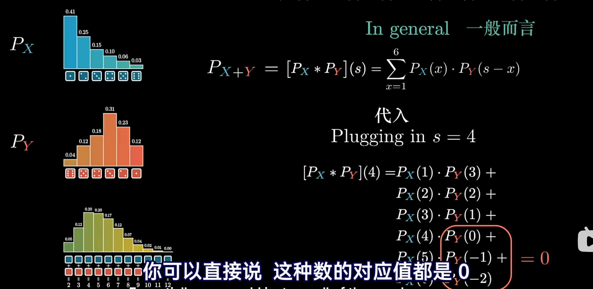
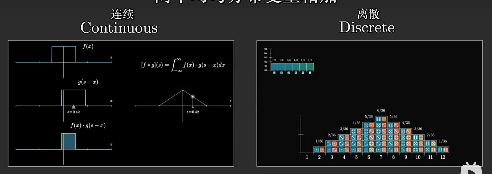
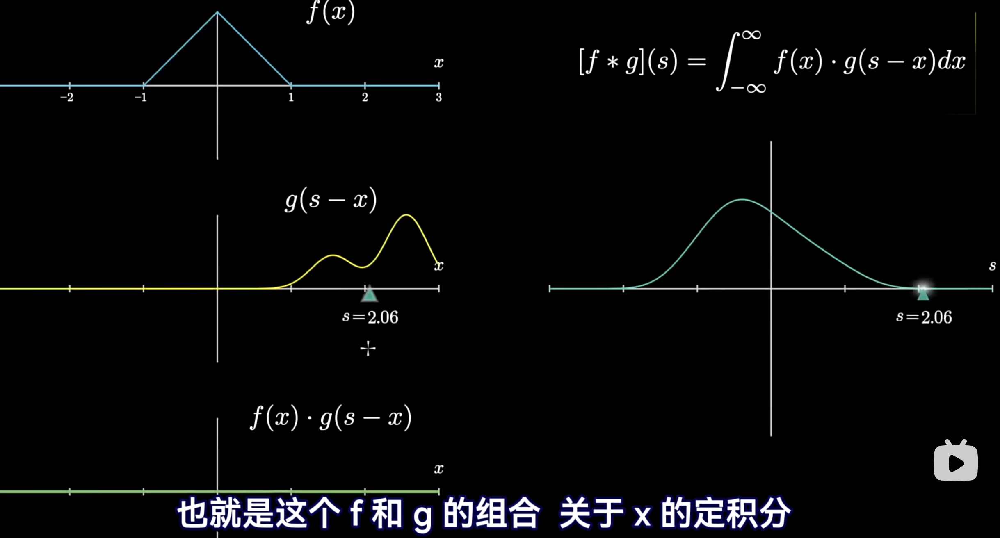
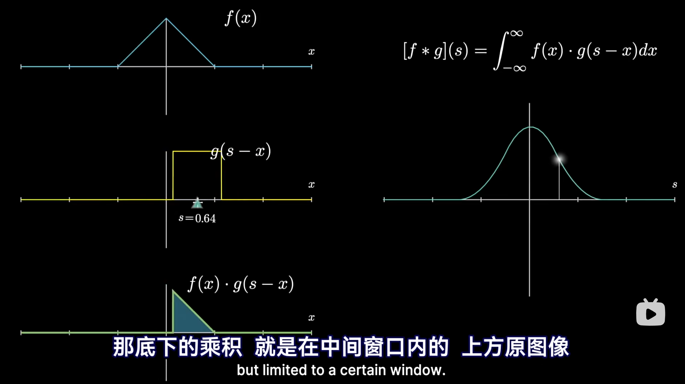
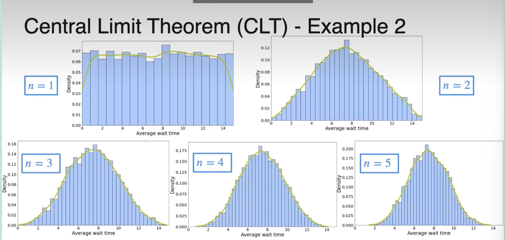
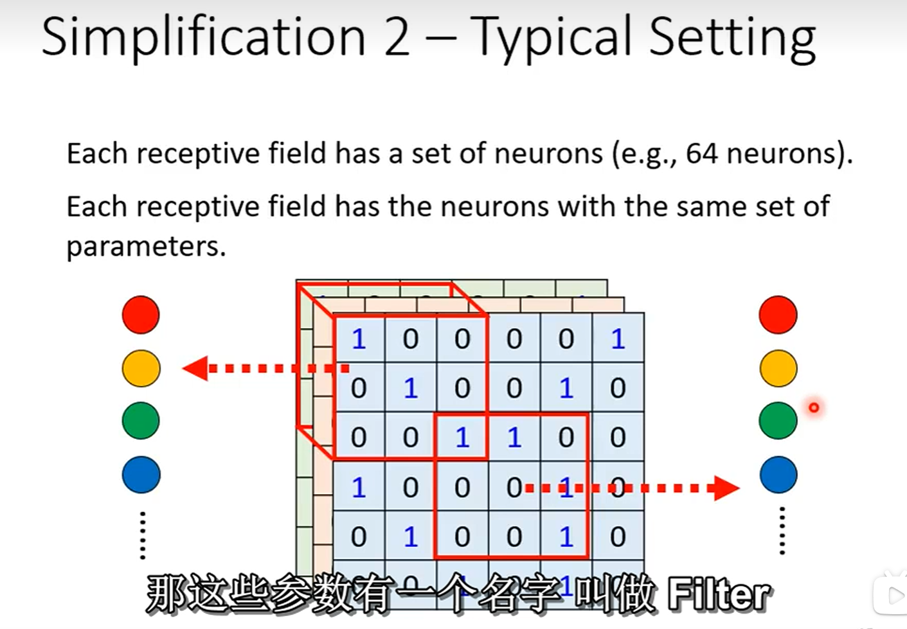

## 概念

首先, 什么是卷积?

卷积是一种特殊的积分变换，它通过以下步骤将两个函数 f 和 g 组合：

1. 将 g 函数翻折（$g (τ)→g (-τ)$）
2. 对于输出的每个时间点 t，将翻折后的 g 函数**平移**到 t 位置（g (-τ)→g (t-τ)）
3. 计算 $f (τ)$ 与平移后的 $g (t-τ)$ 的乘积
4. 对所有τ积分/求和，得到输出点 t 的值

数学表达为：

- 连续情况：$(f * g)(t)$ = $∫f (τ) g (t-τ) dτ$
- 离散情况：$(f * g)[n] = ∑f[k]g[n-k]$

## 分析

### 积分角度

为什么要进行这些操作? 让我们以用两个函数的叠加为背景来分析每个操作的合理性

首先需要确定的是: **卷积中的自变量是 s, 而非 x**, 观察公式

$$y(t) = \int_{-\infty}^{\infty} f(\tau)g(t-\tau)d\tau$$

- T 是我们关心的当前时刻
- τ 是过去的某个时刻
- T-τ 表示"从过去时刻τ到当前时刻 t 的时间差

也就是说我们实际上做的积分是: **过去的每一个时间 τ 的响应叠加起来, 会对当前时间 t 有多大的影响**, 这样看下来是不是简单多了呢?

### 翻折平移

让我们继续换一个视角, 从函数翻折和平移的角度来思考

$g(t-\tau)$ 这个公式从几何角度如何理解? 先把函数**向左(时间提前)** 平移 t 个单位, 然后再左右翻折

让我们继续换一个视角，从函数翻折和平移的角度来思考卷积的几何意义。

  

$g(t-\tau)$ 这个表达式从几何角度如何理解？实际上是先将函数 $g(\tau)$ **左右翻折**得到 $g(-\tau)$，然后再**向右(时间延迟)** 平移 $t$ 个单位得到 $g(t-\tau)$。

  

这个过程可以这样直观理解：想象 $g(x)$ 是一个**滑动的窗口或模板**，我们将这个窗口沿着 $f(x)$ 移动。对于每一个时间点 $t$，我们：

1. 将窗口 $g$ 翻转

2. 将翻转后的窗口中心放在 $t$ 处

3. 计算窗口与 $f(x)$ 的重叠部分（即它们的乘积）

4. 对所有重叠部分求积分，得到卷积结果在 $t$ 处的值

为什么需要翻折？这是因为时间的对应关系。如果直接将 $f$ 和 $g$ 相乘而不翻折 $g$，时间对应关系会出现错误：$f$ 中较早的时间点（左侧）会与 $g$ 中较早的部分（也是左侧）对应。

但在物理系统中，较早发生的输入应该与系统较晚的响应对应——因为输入信号需要时间才能通过系统产生响应。翻折操作正是为了建立这种正确的时间对应关系：$f$ 中较早的输入（左侧）会与翻折后的 $g$ 中较晚的响应（右侧）对应。

这样，卷积操作 $g(t-\tau)$ 精确地捕捉了系统响应的时间演化特性，体现了"过去的输入如何影响当前的输出"这一物理本质。

### 齐次性

卷积操作中的一个重要特性可以通过变量替换关系 $\tau + (t - \tau) = t$ 来理解。这个看似简单的等式实际上揭示了卷积的本质：

在卷积积分 $y(t) = \int_{-\infty}^{\infty} f(\tau)g(t-\tau)d\tau$ 中：

- $\tau$ 表示输入信号发生的时刻

- $t-\tau$ 表示从输入到当前时刻的时间差

- $t$ 是我们关心的当前时刻

这个齐次关系 $\tau + (t - \tau) = t$ 体现了因果性和时间不变性：

1. **时间守恒**：输入时刻加上延迟时间等于输出时刻，这是物理系统中时间流逝的自然表达

2. **坐标变换不变性**：无论我们如何选择时间原点，卷积操作的结果都保持不变，这反映了物理规律的普适性

3. **线性时不变系统的本质**：系统对输入的响应只取决于输入与当前时刻的时间差，而不依赖于绝对时间

从几何角度看，这种齐次性意味着卷积操作可以理解为一种"滑动加权平均"：随着时间点 $t$ 的变化，我们沿着时间轴滑动窗口 $g(t-\tau)$，但窗口的形状（即系统的响应特性）保持不变。

这种齐次性也解释了为什么卷积在频域中对应简单的乘法：时域中的这种"滑动不变性"在频域中表现为各频率分量的独立处理，每个频率分量只受到一个固定因子的调制。

## 卷积有什么用

卷积作为一种基本的数学运算，在多个领域都有广泛应用。以下是几个重要的应用场景：

### 多项式乘法

卷积与多项式乘法有着直接的联系。考虑两个多项式：
$$A(x) = a_0 + a_1x + a_2x^2 + ... + a_nx^n$$
$$B(x) = b_0 + b_1x + b_2x^2 + ... + b_mx^m$$

它们的乘积 $C(x) = A(x) \cdot B(x)$ 的系数可以通过卷积计算：
$$c_k = \sum_{i=0}^{k} a_i b_{k-i}$$

这正是离散卷积的形式。例如，$(1+2x+x^2)(3+x)$ 的展开可以通过计算序列 $[1,2,1]$ 和 $[3,1]$ 的卷积得到 $[3,7,5,1]$，对应多项式 $3+7x+5x^2+x^3$。

事实上, 把 x 换成 10, 这就是我们计算的竖式乘法, 所以~~我们小学二年级就已经学过卷积了~~

### 离散随机变量之和

当两个独立随机变量相加时，其概率分布是原本两个分布的卷积。例如，掷两个骰子并求和：
- 第一个骰子的概率分布：$P_X = [1/6, 1/6, 1/6, 1/6, 1/6, 1/6]$（对应1-6点）
- 第二个骰子的概率分布：$P_Y = [1/6, 1/6, 1/6, 1/6, 1/6, 1/6]$
- 两骰子和的概率分布：$P_{X+Y} = P_X * P_Y$

计算结果为：$[1/36, 2/36, 3/36, 4/36, 5/36, 6/36, 5/36, 4/36, 3/36, 2/36, 1/36]$，对应和为2-12的概率。
### 中心极限定理

中心极限定理与卷积有深刻联系。当我们将多个独立同分布的随机变量相加时，根据卷积的性质，其分布会逐渐接近正态分布。

从数学角度看，这是因为多次卷积操作会使分布变得越来越"光滑"。具体来说：

1. **单个随机变量**：假设我们有一个均匀分布的随机变量X，其概率密度函数是一个矩形。
   
2. **两个随机变量之和**：X₁+X₂的分布是两个均匀分布的卷积，结果是一个三角形分布（也称为辛普森分布）。这已经比原始的矩形分布更加"圆滑"。

3. **三个随机变量之和**：X₁+X₂+X₃的分布是三个均匀分布的卷积，或者说是均匀分布与三角形分布的卷积，结果是一个抛物线形状的分布，更接近钟形。

4. **更多随机变量之和**：随着我们继续增加随机变量，每次卷积操作都会使分布变得更加平滑和对称，锐角被磨平，分布的中心部分变得更加突出。

#### 数学公式描述

假设我们有n个独立同分布的随机变量 $X_1, X_2, ..., X_n$，每个变量的期望为μ，方差为σ²。定义它们的和为：

$$S_n = X_1 + X_2 + ... + X_n$$

根据概率论，$S_n$的期望和方差为：

$$E[S_n] = n\mu$$
$$Var[S_n] = n\sigma^2$$

中心极限定理告诉我们，当n足够大时，$S_n$的标准化形式：

$$Z_n = \frac{S_n - n\mu}{\sigma\sqrt{n}}$$

的分布会收敛到标准正态分布N(0,1)：

$$Z_n \xrightarrow{d} N(0,1)$$

也就是说，当n足够大时，$S_n$近似服从正态分布：

$$S_n \approx N(n\mu, n\sigma^2)$$

#### 为什么会收敛到正态分布？

从傅里叶变换的角度，这一现象可以通过特征函数来解释。随机变量X的特征函数定义为：

$$\phi_X(t) = E[e^{itX}]$$

对于独立随机变量的和，其特征函数是各个变量特征函数的乘积：

$$\phi_{S_n}(t) = [\phi_X(t)]^n$$

当n很大时，可以通过泰勒展开证明：

$$\phi_{S_n}\left(\frac{t}{\sigma\sqrt{n}}\right) \approx e^{-\frac{t^2}{2}}$$

而$e^{-\frac{t^2}{2}}$正是标准正态分布的特征函数。

从卷积角度看，这相当于说：重复卷积同一个分布n次，结果会趋向于正态分布的形状。这是因为卷积在频域对应乘法，多次卷积会强化中频成分，抑制高频成分，使得分布变得光滑且集中。

### 卷积神经网络(CNN)

在深度学习中，卷积神经网络利用卷积操作处理图像、语音等数据。CNN中的卷积层执行的操作是：

$$O[i,j] = \sum_{m}\sum_{n} I[i+m, j+n] \cdot K[m,n]$$

其中：
- $I$ 是输入（如图像）
- $K$ 是卷积核（可学习的权重矩阵）
- $O$ 是输出特征图

卷积操作使CNN具有以下特性：
1. **局部感受**：每个神经元只关注输入的一小部分
2. **参数共享**：同一个卷积核在整个输入上滑动，大大减少参数数量
3. **平移不变性**：无论特征在输入中的位置如何，都能被相同的卷积核检测到

这些特性使CNN在图像识别、物体检测等任务中表现出色，成为计算机视觉领域的基础模型。

虽然话是这么说, 但我感觉卷积和CNN的关系就和老婆饼跟老婆的关系差不多...

## 卷积的深层洞见

除了前文讨论的内容，卷积还有一些更深层次的洞见值得探索：
### 对偶性与不确定性

卷积与傅里叶变换之间存在着深刻的对偶关系，这种关系揭示了信号在时域和频域的基本约束：

1. **时域展宽，频域压缩**：当我们对信号进行卷积（如用高斯函数平滑）时，时域上的信号变得更宽，而其频谱则变得更窄。

2. **不确定性原理**：这种对偶性直接导致了信号处理中的不确定性原理——信号不可能同时在时域和频域上无限集中，这与量子力学中的海森堡不确定性原理有着相似的数学形式。

### 卷积定理的普适性

卷积定理（时域卷积等价于频域乘积）不仅适用于傅里叶变换，还适用于许多其他变换：

1. **拉普拉斯变换**：时域卷积对应s域乘积

2. **Z变换**：序列卷积对应z域乘积

3. **小波变换**：在某些条件下也满足类似性质

这种普适性表明卷积作为一种操作，在数学上具有深刻的内在结构。

### 群论视角

从抽象代数角度看，卷积可以被理解为群上的一种自然运算：

1. **群卷积**：在群G上定义的函数f和g的卷积为：$(f * g)(x) = \int_G f(y)g(y^{-1}x)dy$

2. **不变性**：卷积天然保持群的作用不变性，这解释了为什么卷积在处理具有平移、旋转等对称性的数据时如此有效。

3. **群等变卷积网络**：这一洞见已经推动了深度学习中群等变卷积网络的发展，使网络能够处理具有各种对称性的数据。

### 信息论解释

从信息论角度，卷积可以被理解为：

1. **信息融合**：卷积是一种最优的信息融合方式，在高斯噪声假设下，它等价于贝叶斯推断。

2. **最大熵原理**：在某些约束条件下，卷积产生的分布具有最大熵，这解释了为什么多次卷积会趋向正态分布。

### 卷积定理：时域卷积与频域乘积的对应关系

让我们来探讨一个卷积的核心性质——卷积定理。这个定理告诉我们：**时域中的卷积等价于频域中的乘积**。这听起来很神奇，但背后有着深刻的数学原理。

从数学表达上看，卷积定理可以表示为：

$$\mathcal{F}\{f * g\} = \mathcal{F}\{f\} \cdot \mathcal{F}\{g\}$$

其中 $\mathcal{F}$ 表示傅里叶变换，$f * g$ 表示 $f$ 和 $g$ 的卷积。

#### 为什么会这样？

这种对应关系的本质可以从卷积的定义出发来理解。回顾卷积的定义：

$$y(t) = \int_{-\infty}^{\infty} f(\tau)g(t-\tau)d\tau$$

当我们对这个式子进行傅里叶变换时，会发生什么？

傅里叶变换将时域信号分解为不同频率的正弦波的叠加。对于每个频率分量 $\omega$，卷积的傅里叶变换可以写为：

$$\mathcal{F}\{f * g\}(\omega) = \int_{-\infty}^{\infty} \left( \int_{-\infty}^{\infty} f(\tau)g(t-\tau)d\tau \right) e^{-j\omega t} dt$$

通过变换顺序和变量替换，可以证明这等价于 $F(\omega) \cdot G(\omega)$，其中 $F(\omega)$ 和 $G(\omega)$ 分别是 $f(t)$ 和 $g(t)$ 的傅里叶变换。

#### 从滑动加权平均的角度理解

还记得我们之前讨论的"滑动加权平均"视角吗？卷积本质上是一种滑动窗口操作，窗口形状保持不变，只是位置在变化。

在频域中，这种"滑动不变性"表现为什么呢？答案是：**频率分量的独立调制**。

每个频率分量都被独立地调整幅度和相位，而不会与其他频率产生"混淆"。这正是乘法的特性！对于频谱 $F(\omega)$ 中的每个分量，我们只需将其乘以 $G(\omega)$ 中对应频率的值即可。

#### 齐次性的体现

这种对应关系也是卷积齐次性的一种体现。我们之前讨论过，卷积中的齐次关系 $\tau + (t - \tau) = t$ 体现了时间不变性。在频域中，这种不变性转化为频率分量的独立处理。

时域中的"滑动不变性"意味着系统对输入的响应只取决于输入与当前时刻的时间差，而不依赖于绝对时间。这种性质在频域中自然对应为各频率分量的独立调制。

#### 计算效率的提升

这种对偶性不仅具有理论意义，还带来了实际的计算优势。对于长序列的卷积，直接计算的复杂度是 $O(n^2)$，而利用快速傅里叶变换 (FFT)，我们可以将复杂度降低到 $O(n\log n)$：

1. 对输入信号进行 FFT
2. 在频域中相乘
3. 进行逆 FFT 得到结果

这种"变换-乘积-逆变换"的策略大大提高了卷积的计算效率，在信号处理、图像处理等领域有着广泛应用。

总的来说，时域卷积等于频域乘积这一性质，揭示了卷积作为一种数学操作的内在优雅性，它将时域中复杂的积分操作转化为频域中简单的乘法，体现了数学中常见的"复杂问题简单化"的美妙转换。

## 总结

卷积本质上是一种时空融合的数学语言，通过"滑动加权平均"将两个函数的全局信息深度融合：在时域体现为系统对**历史输入的累积响应**，在频域展现为**频率分量的优雅调制**，在概率论中呈现为**随机涨落的光滑收敛**，在深度学习中则演化为**特征提取的通用范式**。这种独特的组合方式——**以函数为权重、以积分为纽带、以对称为灵魂**——使其成为贯通信号处理、概率论、物理学和人工智能的基础性思维工具，既刻画着自然界的因果律动，也驱动着现代科技的智能演进。(本段总结由 Deepseek 生成)

