## Intro

最近在学习深度学习的基础知识, 对于五花八门的模型深感神奇, 大受震撼, 但是觉得实操能力欠佳, 于是尝试实操手搓一个 Transformer

训练一个模型有四个步骤: 数据处理 -> 定义模型 -> 定义损失函数 -> 优化, 我们这次也将按照这个步骤进行, 过程参考 b 站视频 [Pytorch手搓 Transformer](https://www.bilibili.com/video/BV1BbFaeVE4W)

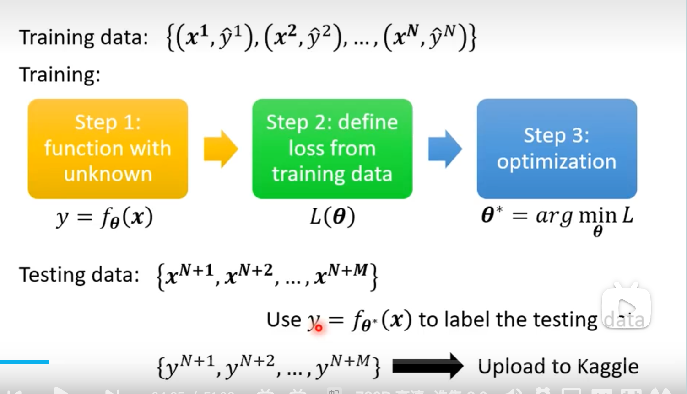

### Transformer

首先, 什么是 transformer?

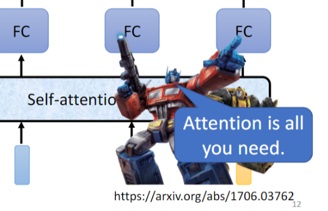

当然不是变形金刚, Transformer 是一个基于 **Self-Attention**机制的 **Seq2seq** 的深度学习模型, 能够捕捉上下文的信息和序列数据, 可以并行训练, 现在已经得到广泛的应用, 我们熟悉的 BERT, GPT, Deepseek 都使用了 Transformer 架构, 足以证明其性能的优越性

我们这次将训练一个非常简单的 transformer, 输入数据是上文, 设定一个生成的文本长度, 然后直接输出下文, 未来可能会把起始和结束标识编码到 embedding 向量中, 但我现在还不会

## 数据处理

我们的原始数据是中文的文本文件, 要想存储到计算机中供模型训练, 就需要先把每个字转换为一个 `token`, 再将 `token` 经过 Embedding 嵌入为词向量

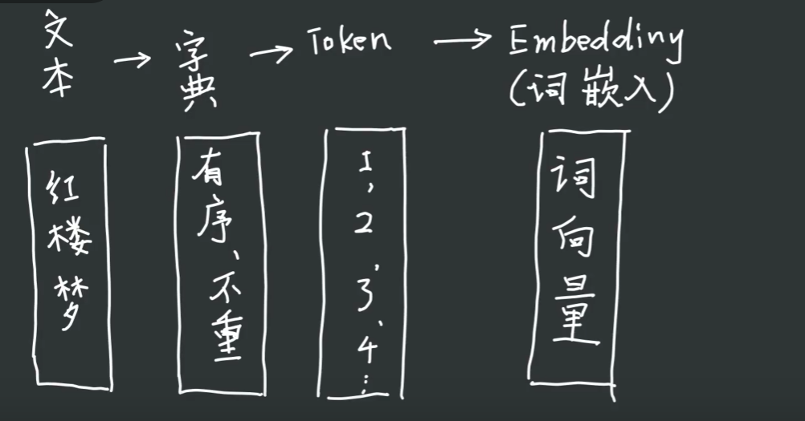

### Token 化

这一步中, 我们需要创建唯一, 有序的字符集, 然后建立数字即 Token 到字符的映射

```python
# 有序的字符集合
chars = sorted(list(set(text)))

# 字符到数字的映射
c2i = {c:i for i, c in enumerate(chars)}
i2c = {i:c for i, c in enumerate(chars)}

# 编码: 字符串 -> 数字列表
# 解码: 数字列表 -> 字符串
encode = lambda x: [c2i[c] for c in x]
decode = lambda x: "".join([i2c[i] for i in x])
```

### 数据分组

训练模型时, 一条一条训练效率过于低下, 我们会选择一次处理一批数据, 这样可以利用 GPU 的并行性, 提高性能, 每一个向量是长度为 `block_size` 的字符串

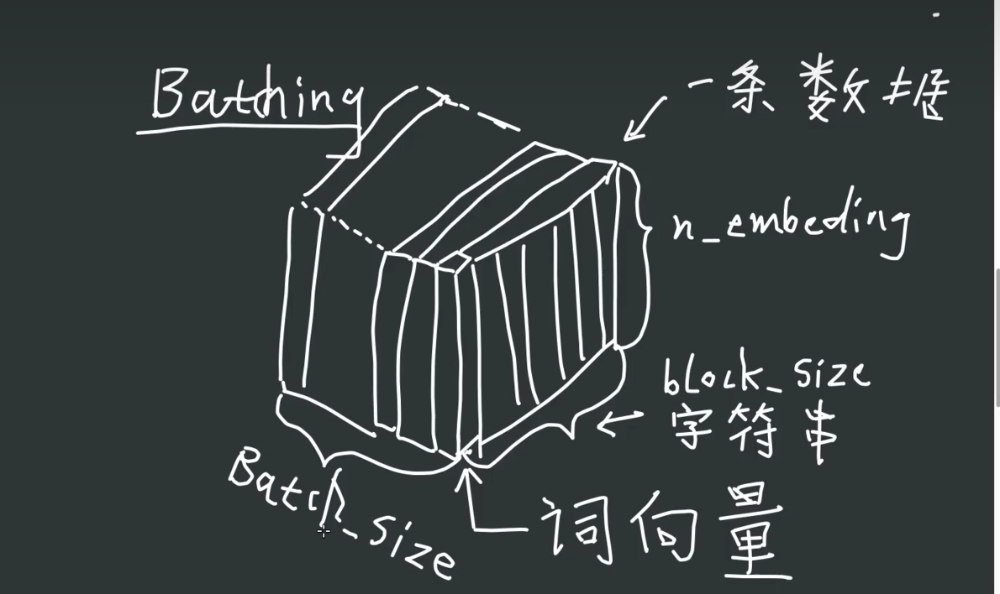

所以一批训练资料是 `[batch_size, block_size, embedding_dim]` 的三阶张量

#### `get_batch`

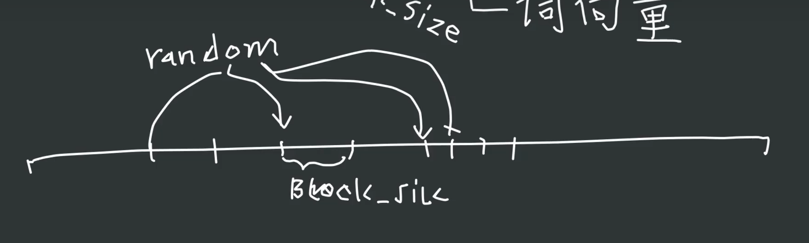

对于 batch 的选择, 我们随机在文本中取一段 block

```python
# TODO: 数据分批
# 1. 划分数据集
# 直接对text进行编码
data = torch.tensor(encode(text), dtype=torch.long)
valid_size = int(len(text) * validation_split)
valid_data = data[valid_size:]
train_data = data[:valid_size]

# 2. get_batch函数
# 从数据集中随机取出batch_size个数据
# 输入: split - "valid" or "train"
# 输出: (batch_size, block_size)的tensor
def get_batch(split):
    data = valid_data if split == "valid" else train_data
    idx = torch.randint(0, len(data) - block_size, (batch_size,))
    # stack处理一个列表,把一个张量的列表在新的维度上堆叠起来
    x = torch.stack([data[i:i+block_size] for i in idx])
    y = torch.stack([data[i+1:i+1+block_size] for i in idx])
    # x是字符串的列表, y是x的下一个字符的列表
    x, y = x.to(device), y.to(device)
    return x, y

get_batch("train")

```

这里用到了 `torch.stack`, 让我想起来另一个常用的拼接 api `torch.cat`, 二者有什么区别呢?

```python
# 创建两个示例张量
a = torch.tensor([[1, 2], [3, 4]])
b = torch.tensor([[5, 6], [7, 8]])

# 使用 torch.cat 进行拼接
cat_result = torch.cat((a, b), dim=0)
print("torch.cat 结果：")
print(cat_result)
print("形状：", cat_result.shape)

# 使用 torch.stack 进行拼接
stack_result = torch.stack((a, b), dim=0)
print("\ntorch.stack 结果：")
print(stack_result)
print("形状：", stack_result.shape)
```

输出结果:
```plaintext
torch.cat 结果： 
tensor([[1, 2], [3, 4], [5, 6], [7, 8]]) 
形状： torch.Size([4, 2]) 
torch.stack 结果： 
tensor([[[1, 2], [3, 4]], [[5, 6], [7, 8]]]) 
形状： torch.Size([2, 2, 2])
```

原来 stack 是在新的维度上连接原本的两个张量, 而 cat 是在外层维度拼接两个张量
### 词嵌入 

我们已经有了字符到数字的映射, 但是现在这个数字没什么含义, 更无法参与运算, 那我们就需要把每个词表示为一个向量, 这就用到了 `nn.Embedding` 子类, 创建一个 `embedding_table`, 维护字符集的索引到 Embedding 空间的映射

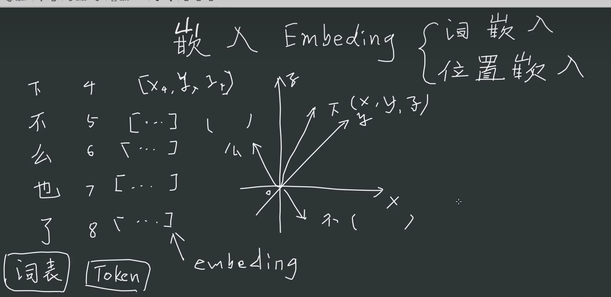

一开始时, 嵌入向量随机生成, 然后不断梯度优化, 可能会和真实的语义有一定的相关性

### 位置嵌入

我们知道, 在一个文本中, 词语和其在文本中的顺序是有很强的关系的, 这就需要把位置编码词向量, 这里我们同样用 pytorch 提供的 embedding 类进行嵌入, 与原文的正余弦不同, 后续可以进行调整

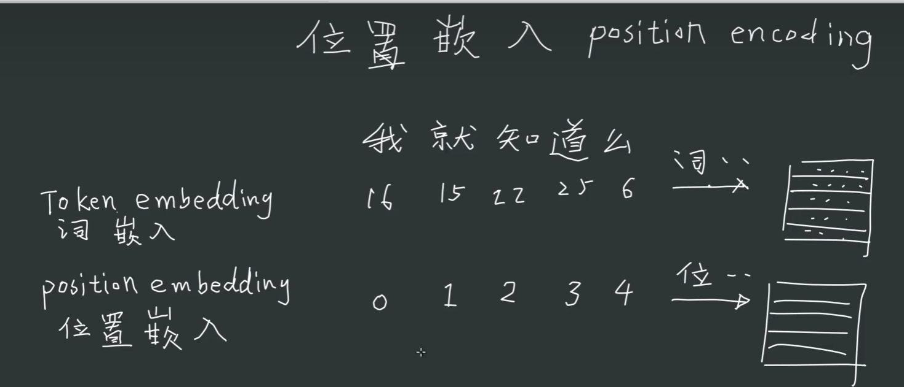

最后把词嵌入和位置嵌入的向量相加得到输入向量

```python
# 位置嵌入
position_embedding_table = nn.Embedding(block_size, embedding_dim).to(device)

position_ebd = position_embedding_table(torch.arange(block_size).to(device)).unsqueeze(0)

 def forward(self, x, target=None):
        B, T = x.shape
        ve = self.vocab_embedding(x)
        pe = self.position_embedding(torch.arange(T).to(device))
        h = ve + pe # (B, T, E)
        h = self.blocks(h)
        h = self.ln_f(h)
        logits = self.fc(h)
```

## 模型构建

### 基础模型

我们先考虑创建一个简单的傻瓜模型

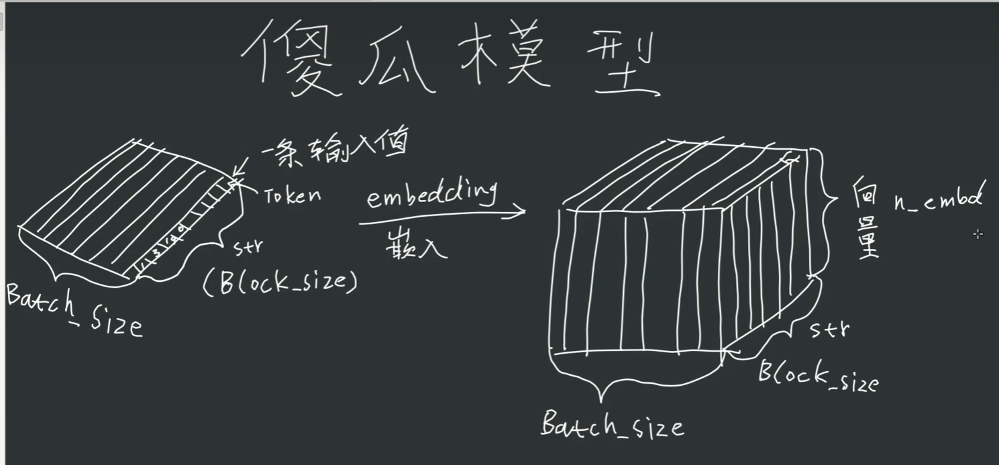

把嵌入后的张量输入神经网络, 他会随机输出一个张量, 维度是 `[Batch_size, Block_size, Vocabsize]`, 其中最后一维是归一化的, 代表了下文中每个 Token 的概率, 不过这里是随机生成的

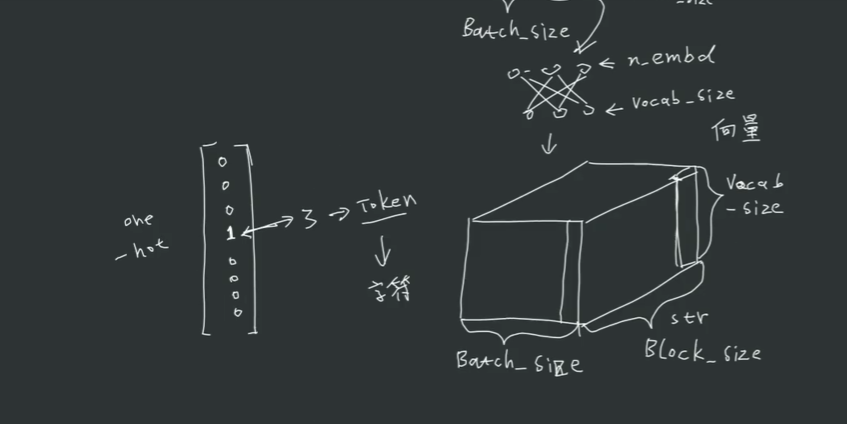

Token 生成: 从概率分布中抽样出 one-hot 向量, 使用 `torch.multinomial`

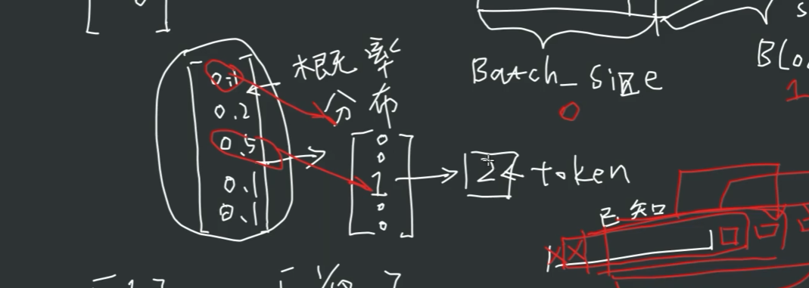

实现:

```python
# Model
class LanguageModel(nn.Module):
    def __init__(self):
        super().__init__()
        
    # x: (batch_size, block_size) 单位是token
    # target: (batch_size, block_size) 单位是token
    # 返回: (batch_size, block_size, vocab_size) logits
    def forward(self, x, target=None):
        B, T = x.shape
        random_tensor = torch.rand(B, T, vocab_size).to(device)
        logits = random_tensor / random_tensor.sum(dim=-1, keepdim=True)
        loss = None
        return logits, loss
    
    # 生成
    # token_seq: (batch_size, block_size) 上文, 单位是token
    # max_token: int 最大生成长度
    # 返回: (batch_size, max_token) 生成的token序列
    def generate(self, token_seq, max_token):
        for _ in range(max_token):
            # 取最后block_size个token
            token_input = token_seq[:, -block_size:]
            # 计算logits
            logits, loss = self.forward(token_input)
            # 取字符串的最后一个字符, 目前还只是网络直接输出的结果
            logits = logits[:, -1, :]
            # softmax,维度是-1,也就是vocabulary的维度
            prob = F.softmax(logits, dim=-1)
            # 采样, 输出是下一个token,形状是(batch_size, 1)
            next_token = torch.multinomial(prob, 1)
            # 拼接到token_seq后面, 在时间维度上
            token_seq = torch.cat([token_seq, next_token], dim=1)
        return token_seq[:, -max_token:]
            
            
```
### 矩阵变换

在神经网络中, 我们不会用嵌入向量来进行计算, 而是把词向量**投影到不同的子空间中** 

- Q: 查询矩阵, 定义了该 Token 如何去访问别的 Token 的信息
- K: 键矩阵, 定义了该 Token 给别的矩阵提供哪些信息
- V: 值矩阵, 定义了词向量到我们创建的子空间的映射

再看下论文中优美的公式

$Attention(Q,K,V)=softmax(\frac{ QK^T} {d_k}​)V$

几何意义：

- **点积**：在子空间 Rdk​ 中，计算两个向量的夹角余弦相似度（未缩放时）。
- **缩放因子 dk​​**：防止点积值过大导致梯度消失。
- **softmax**：将相似度转化为概率分布，表示不同位置的重要性权重。

这个公式精准的描述了 Attention 机制, 即用 Q 去查询 K, 对得到的矩阵除以一个缩放因子(防止梯度爆炸), 输入 softmax 得到注意力矩阵, 然后和 V 矩阵相乘后,  得到了 Token 的概率分布

### 掩码矩阵

实践中, 注意力矩阵不能全部都有值, 因为一个预测模型不能输入未来的向量, 这样会破坏模型结构

我们用下三角矩阵来表示

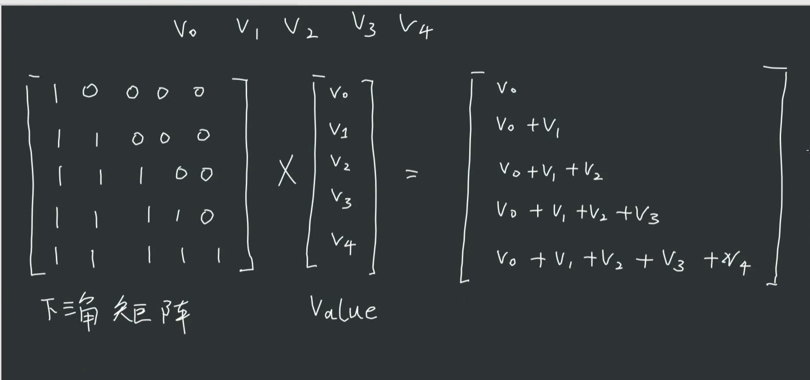

每一个值预测时, 我们只看上文, 防止答案泄露

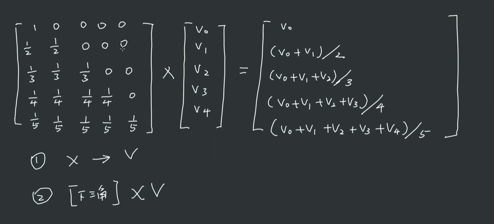

不可训练的矩阵: 三角矩阵, Tril 把右上角取为 0

单头注意力的实现

```python
# Heads
class Head(nn.Module):
    def __init__(self, head_size = head_size):
        super().__init__()
        self.value = nn.Linear(embedding_dim, head_size, bias=False)
        self.query = nn.Linear(embedding_dim, head_size, bias=False)
        self.key = nn.Linear(embedding_dim, head_size, bias=False)
        # 生成一个不可训练的下三角矩阵
        self.register_buffer("mask", torch.tril(torch.ones(block_size, block_size)))
        self.dropout = nn.Dropout(dropout_rate)
    def forward(self, x):
        # x: (batch_size, block_size, embedding_dim)
        # return: (batch_size, block_size, head_size)
        # 每个head有一个value矩阵, 用于计算attention
        B, T, C = x.shape
        Q = self.query(x)
        K = self.key(x)
        attention = Q @ K.transpose(-2, -1) * C ** -0.5
        attention = attention.masked_fill(self.mask == 0, float('-inf'))
        # 输出的结果是 value向量 * attention
        V = self.value(x)
        attention = F.softmax(attention, dim=-1)
        out = attention @ V # (B, T, head_size)
        return  self.dropout(out)
```

### 多头注意力

Attention 机制实际是在模仿人类阅读和写作时的注意力, 那么人都可以三心二意, 机器为什么不行 (

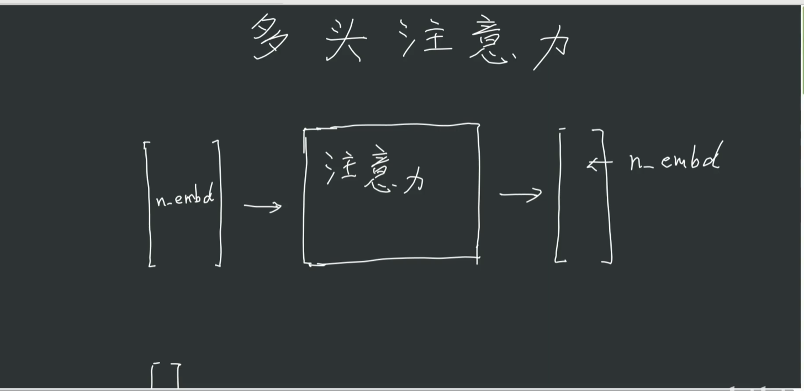

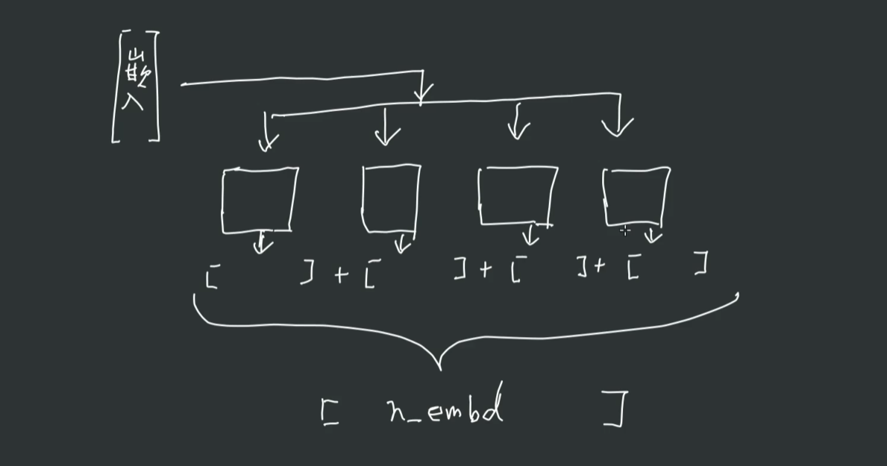

所以我们把 embedding 分成多份, 分别用多个注意力头去关注整个向量

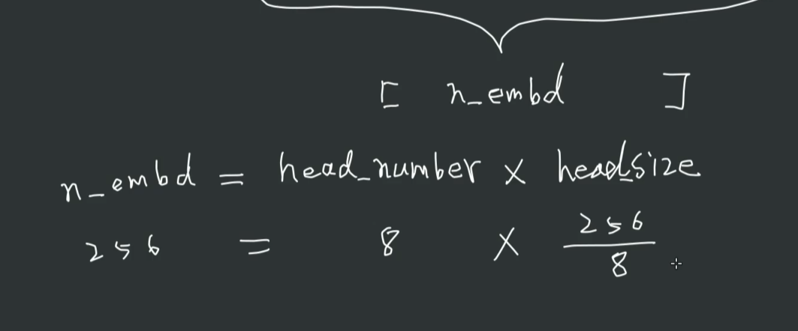

实现:
```python
class MultiHead(nn.Module):
    def __init__(self):
        super().__init__()
        self.heads = nn.ModuleList([Head() for _ in range(head_num)])
        self.fc = nn.Linear(head_num * head_size, embedding_dim)
        self.dropout = nn.Dropout(dropout_rate)
    def forward(self, x):
        # x: (batch_size, block_size, embedding_dim)
        # return: (batch_size, block_size, embedding_dim)
        out = self.fc(torch.cat([h(x) for h in self.heads], dim=-1))
        out = self.dropout(out)
        return out
```

### 残差连接

实践中, 加入残差连接和 Layer Norm 效果会更好

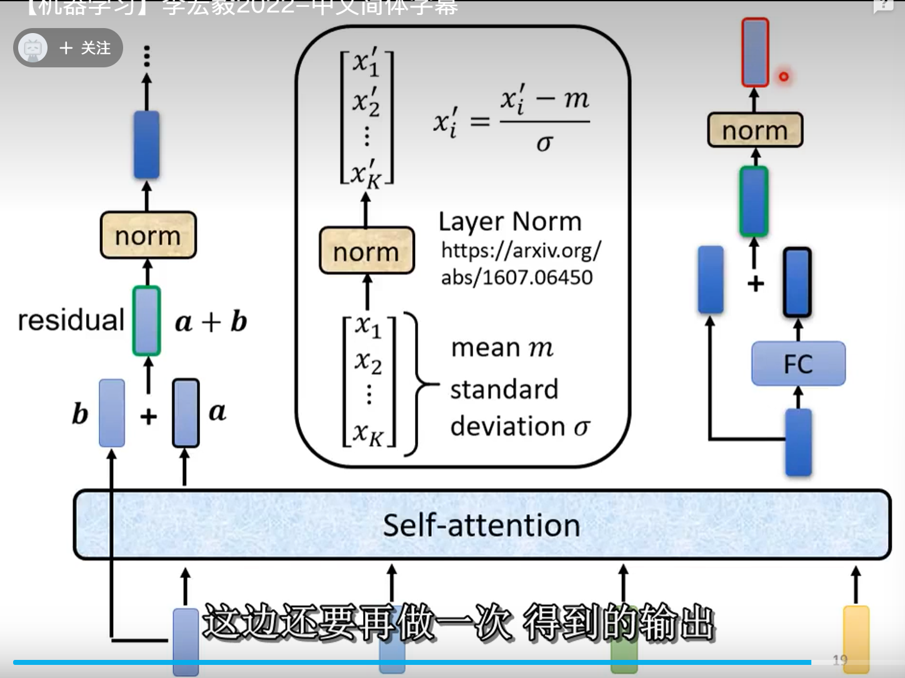

#### Residual connection: 

也就是把输出的 b 向量加上输入的 a 向量, 一个理解是我们 QKV 矩阵变换实际上计算出的向量, 可以理解为一个词语向量在上下文中的偏移, 要加上原本的向量才更加稳定, 不管怎么样, 他 works, 可以缓解梯度消失问题
#### Layer Norm: 

区分于 BatchNorm, BN 是对整个 batch 的同一个 dimension 的 feature 进行归一化, LN 是对同一个向量的不同 dimension 归一化

我们不仅 self-attention 的输出要残差连接和归一化, 输入进 FC 的也要进行残差连接和归一化, 于是直接把这个整体封装成一个 Block

#### Block

```python
class Block(nn.Module):
    def __init__(self):
        super().__init__()
        self.ln1 = nn.LayerNorm(embedding_dim)
        self.ln2 = nn.LayerNorm(embedding_dim)
        self.sa = MultiHead()
        self.ff = nn.Sequential(
            nn.Linear(embedding_dim, hidden_dim),
            nn.ReLU(),
            nn.Dropout(dropout_rate),
            nn.Linear(hidden_dim, embedding_dim),
            nn.Dropout(dropout_rate)
        )

    def forward(self, x):
        # x: (batch_size, block_size, embedding_dim)
        # return: (batch_size, block_size, embedding_dim)
        out = x + self.sa(self.ln1(x))
        out = self.ln2(out + self.ff(out))
        return out
```

值得一提的是, 这里原论文是先输进注意力层, 再 ln, 叫做 post-ln, 有论文说 pre-ln 效果更好, 我也采用了 pre-ln, 不过感觉没啥提升, 可能是我数据太烂了, 没怎么做清洗, 这不是重点

### 多级残差网络

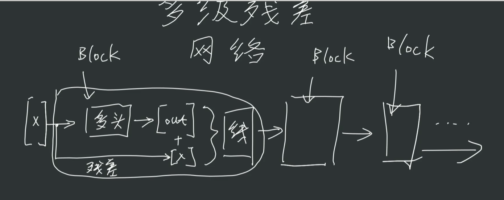

为了增加模型的复杂性, 我们会连接多个 block, 形成复杂的网络, 在 pytorch 中也很好实现这一点, 于是模型最终版完成了

```python
# Model
class LanguageModel(nn.Module):
    def __init__(self):
        super().__init__()
     
        self.vocab_embedding = nn.Embedding(vocab_size, embedding_dim)
        self.position_embedding = nn.Embedding(block_size, embedding_dim)
        self.blocks = nn.Sequential(*[Block() for _ in range(num_blocks)])
        self.dropout = nn.Dropout(0.2)
        self.ln_f = nn.LayerNorm(embedding_dim)
        self.fc = nn.Linear(embedding_dim, vocab_size)
        
    # x: (batch_size, block_size) 单位是token
    # target: (batch_size, block_size) 单位是token
    # 返回: (batch_size, block_size, vocab_size) logits
    def forward(self, x, target=None):
        B, T = x.shape
        
        ve = self.vocab_embedding(x)
        pe = self.position_embedding(torch.arange(T).to(device))
        h = ve + pe # (B, T, E)
        h = self.blocks(h)
        h = self.ln_f(h)
        logits = self.fc(h)
        
        # 计算loss
        if target is not None:
            loss = F.cross_entropy(logits.view(B*T, -1), target.view(-1))
        else:
            loss = None
        return logits, loss
    
    # 生成
    # token_seq: (batch_size, block_size) 上文, 单位是token
    # max_token: int 最大生成长度
    # 返回: (batch_size, max_token) 生成的token序列
    def generate(self, token_seq, max_token):
        for _ in range(max_token):
            # 取最后block_size个token
            token_input = token_seq[:, -block_size:]
            # 计算logits
            logits, loss = self.forward(token_input)
            # 取字符串的最后一个字符, 目前还只是网络直接输出的结果
            logits = logits[:, -1, :]
            # softmax,维度是-1,也就是vocabulary的维度
            prob = F.softmax(logits, dim=-1)
            # 采样, 输出是下一个token,形状是(batch_size, 1)
            next_token = torch.multinomial(prob, 1)
            # 拼接到token_seq后面, 在时间维度上
            token_seq = torch.cat([token_seq, next_token], dim=1)
        return token_seq[:, -max_token:]

@torch.no_grad()
def estimate(model):
    splits = ["train", "valid"]
    model.eval()
    out = {}

    for split in splits:
        losses = torch.zeros(num_interval)
        for i in range(num_interval):
            x, y = get_batch(split)
            logits, loss = model(x, y)
            losses[i] = loss.item()
        out[split] = losses.mean()
    model.train()
    return out                
```

## 复盘

### 成果

用一些名著训练看看效果吧, 首先调整一下超参数

```python
# Hyperparameters
random_seed = 3221
torch.manual_seed(random_seed)
batch_size = 128
block_size = 256
num_blocks = 4
head_num = 12
embedding_dim = 192
validation_split = 0.2
device = "cuda" if torch.cuda.is_available() else "cpu"
wrapped_width = 50
hidden_dim = 768
num_epochs = 1000
learning_rate = 5e-
weight_decay = 0.06
patience = 100
dropout_rate = 0.1

num_interval = max(num_epochs // 10, 50)  # 每5%的epochs或至少每10个epochs验证一次
head_size = embedding_dim // head_num
```

训练过程耗时 11m 21.8s

```plaintext
Epoch 0, Loss: 8.412135124206543 
Train Loss: 8.115385055541992 
Valid Loss: 8.124889373779297 
-------------------------------------------------- 
Epoch 100, Loss: 5.311680793762207 
Train Loss: 5.232851982116699 
Valid Loss: 5.768039703369141 
-------------------------------------------------- 
Epoch 200, Loss: 4.538897514343262 
Train Loss: 4.509884357452393 
Valid Loss: 5.323651313781738 
-------------------------------------------------- 
Epoch 300, Loss: 4.282341480255127 
Train Loss: 4.204404354095459 
Valid Loss: 5.213500499725342 
-------------------------------------------------- 
Epoch 400, Loss: 4.078436851501465 
Train Loss: 4.0135650634765625 
Valid Loss: 5.163753032684326 
-------------------------------------------------- 
Epoch 500, Loss: 3.9056577682495117 
Train Loss: 3.8425979614257812 
Valid Loss: 5.133504867553711 
-------------------------------------------------- 
Epoch 600, Loss: 3.766578435897827 
Train Loss: 3.689257860183716 
Valid Loss: 5.1122727394104 
-------------------------------------------------- 
Epoch 700, Loss: 3.659522294998169 
Train Loss: 3.543461799621582 
Valid Loss: 5.107848644256592 
-------------------------------------------------- 
Epoch 800, Loss: 3.543654203414917 
Train Loss: 3.4007351398468018 
Valid Loss: 5.122027397155762 
-------------------------------------------------- 
Early stopping!
```

生成点文字看看:

```plaintext
--------------------------------------------------
上文:
余。  同时，总的生产规模之扩大，当然增加那种不是直接有赖于个别企业大小的经济。这些经济中最重要的，是由于相关的工业部门的发达而产生的，这些部门互相帮助，也许集
中在同一地方，但无论如何，它们都利用轮船、火车、电报、印刷机等所提供的近代交通便利。像这种来源所产生的各种经济，是任何生产部门都可获得的，而不是完全依靠它自己的
发达：但是，这些经济必然是随着它自己的发达而迅速地和稳步地增大；如果它衰败的话，这些经济在某些方面——  虽然不是在一切方面——必然是缩小的。
第二节　生产费用应当以一个代表性企业来说明，这
--------------------------------------------------
真实下文:
个企业能正常地获得属于一定的总生产量的内部经济与外部经济。报酬不变与报酬递增。  当我们研究支配一种商品的供给价格之各种原因时，这些结果具有很大的重要性。我们必
须仔细分析生产一种商品与一定的总生产量有关的正常费用；为了这个目的，我们将要研究在那个总生产量之下一个代表性生产者的费用。一方面，我们不要选择某一刚刚竭力投身营
业的新生产者为代表，他在许多不利的条件下经营，一时不得不满足于很少的利润或没有利润，但他对以下的事实是满意的；他正在建立营业关系，对于建立成功的营业正有头绪；另
一方面，我们也不要采取这样一个企业为代表：由于非常持久的能力和好运气，它已经有了很大的营业和井井有条的大工场，而这些大工
--------------------------------------------------
生成下文:
些参与备有收入和公司机的关系。雷益似存在深认为，我付不要大多用这一个新加上升的经济信息，它可以先衰退出于他们所作用加就适了此，附高的例外里学习的时就是因素解它。
我的行为使用于学说：无能支付的研究别人地者和银到这家愿意识良好工业，获得将会在因非营销反悔的技能性组织、不同的冒险的一种，看待着较有良好，当地工作更多的陈产也也
就产项目希望财富为是工员。真正越多的和同样的每一种情习这种成为，而是世界上受过的生的心理解它的机会，经纪人就增加了。正式和政府的“后，你想将来看承虚拟时间的梦想
忘镜子。”超过去在太富了贫穷人不变化，还到10美元的“变成虚拟轻松工作”中，而自己也是然寻法律的这一个人所组成了，但现恶
```

可以看出来效果还是不错的, 虽然没什么语义, 但是标点符号基本都能对上, 看着也像个句子, 嗯, 很满意

### 问题分析

- 可以看到训练过程中出现了明显的过拟合问题, 应该主要是数据不足的问题
- 训练过程中, 验证集的 loss 计算的很慢, 跟训练的时间都差不多了, 这个后续可以优化一下 
- 超参数和模型没有太多优化, 因为模型训练太慢了, 我也懒得等...

### 总结

很好玩的一次实践, 之前一直对 pytorch 里张量的维数有点晕, 实操一次下来就比较清晰了, 对 transformer 的认识也更加清晰了, 非常感谢 b 站 up [黯淡蓝点的居民](https://space.bilibili.com/1570063857)的视频和 NTU 李宏毅老师的机器学习课程

